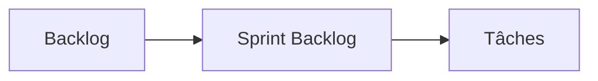
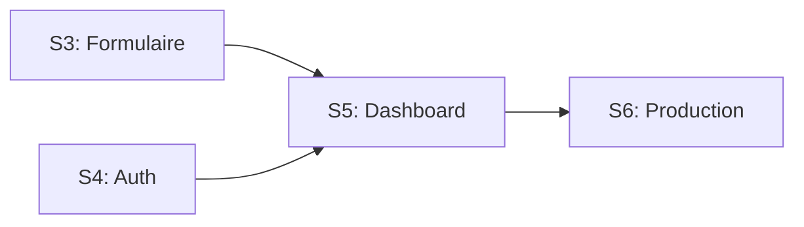
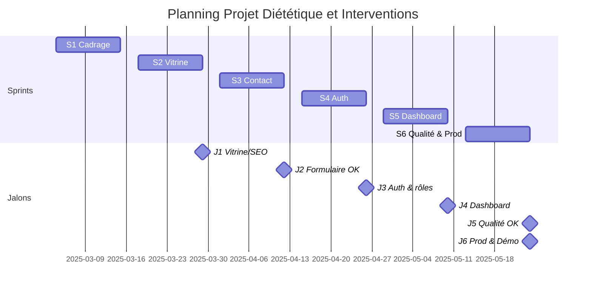
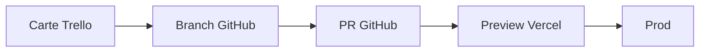
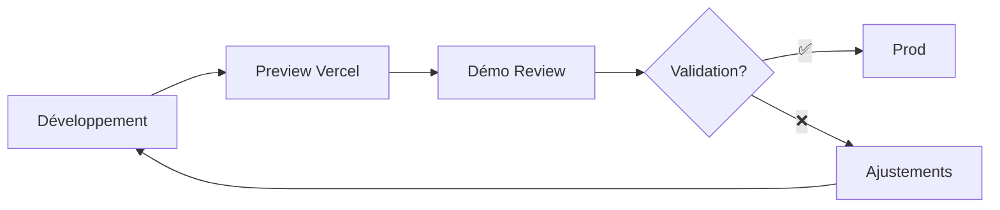

# Diététique et Interventions

## Présentation du projet & démo (Bloc 3)

### Coordonner et piloter un projet de développement d'applications logicielles

<div class="mt-6 card brand">
  <strong>Mars → Juin 2025 (3 mois) — Développeur unique</strong>
  
</div>

<div class="mt-4 card lead">
  <p class="text-lg">
    <strong>Objectif :</strong> site vitrine + back-office de gestion des demandes de contact
  </p>
</div>

<div class="mt-4 card compact muted">
  <p><strong>Repo :</strong> https://github.com/Adrien490/dietetique-et-interventions</p>
  <p><strong>Prod :</strong> https://dietetique-et-interventions.manonchaillou.fr</p>
</div>

<!--
NOTES ORAL (2min) - Introduction :
• ACCROCHE : "Bonjour ! Je suis Adrien et je vais vous raconter comment j'ai mené ce projet de A à Z"
• LE DÉFI : Créer un site complet pour une diététicienne (vitrine publique + espace privé de gestion)
• PREUVE CONCRÈTE : Site en ligne sur dietetique-et-interventions.manonchaillou.fr + code sur GitHub
• ANNONCE PLAN : "Aujourd'hui : planification, pilotage, décisions importantes, et démo en direct !"
• TRANSITION : "Commençons par voir comment j'ai organisé tout ça..."
-->

---

# Sommaire aligné au référentiel

<div class="columns-2">
  <div class="card centered"><strong>C3.1 Planifier</strong></div>
  <div class="card centered"><strong>C3.2.1 Piloter</strong></div>
  <div class="card centered"><strong>C3.2.2 Arbitrer</strong></div>
  <div class="card centered"><strong>C3.3.1 Manager l'équipe</strong></div>
  <div class="card centered"><strong>C3.3.2 Évaluer & développer</strong></div>
  <div class="card centered"><strong>C3.4.1 Suivi client & indicateurs</strong></div>
  <div class="card centered"><strong>C3.4.2 Démonstration</strong></div>
</div>
<!--
NOTES ORAL (3min) - Sommaire & Méthodologie :
• POINTER LA SLIDE : "Comme vous le voyez, j'ai organisé ma présentation autour des compétences du référentiel"
• RASSURER : "Chaque point sera illustré avec des exemples concrets !"
• QUESTION RHÉTORIQUE : "Pour organiser ce projet, j'ai choisi Scrum. 'Scrum tout seul ?', vous allez me dire..."
• JUSTIFICATION : "Eh bien oui ! Même en solo, ça m'apporte un cadre structuré et de l'amélioration continue"
• RÔLES SIMPLES : "La diététicienne = Product Owner (besoins), moi = Scrum Master (organisation) + équipe dev"
• RYTHME : "Cycles de 2 semaines = bon rythme sans pression"
-->

---

# Méthodologie choisie (C3.1) — Scrum (1/3)

## Approche Agile Scrum adaptée à un développeur unique

**Timeboxes sprints :** 2 semaines

### Rôles

- **Product Owner** = commanditaire
- **Scrum Master** = Adrien (facilitateur)
- **Dev Team** = Adrien

<!--
NOTES ORAL - Rôles Scrum adaptés :
🎯 CONTEXTE : "Concrètement, j'ai réparti les rôles même en solo"
👩‍💼 PRODUCT OWNER : "La diététicienne devient la 'Product Owner' - elle définit les besoins"
🎪 DOUBLE CASQUETTE : "Moi, je joue à la fois le 'Scrum Master' qui organise, et l'équipe de développement qui code"
📅 TIMEBOXING : "Je travaille par cycles de 2 semaines - ça donne un bon rythme sans me mettre trop de pression"
💪 BÉNÉFICES : "Même en solo, ça m'apporte structure, transparence et amélioration continue"
➡️ TRANSITION : "Voyons maintenant comment j'organise ces cycles..."
-->

---

# Méthodologie choisie (C3.1) — Scrum — Événements (2/3)

### Événements

| Événement                | Format               | Durée     | Objectif                        |
| ------------------------ | -------------------- | --------- | ------------------------------- |
| **Sprint Planning**      | Début sprint         | 1h        | Objectif sprint, sprint backlog |
| **Daily**                | Asynchrone via board | 5 min     | Blocages, priorités du jour     |
| **Sprint Review**        | Hebdo présentiel     | -         | Démo increment Preview/Prod     |
| **Sprint Retrospective** | Fin de sprint        | 20-30 min | Amélioration processus          |

<!--
NOTES ORAL - Événements Scrum adaptés :
📋 PLANNING : "Je planifie chaque cycle en 1 heure - objectif + tâches à faire"
📱 DAILY MALIN : "Je fais le point quotidien via mon tableau Trello plutôt qu'en réunion - évite la surcharge !"
🎥 REVIEWS CLÉS : "Je présente les avancées chaque semaine à la cliente - maintient l'alignement"
🔄 RÉTRO UTILE : "Je prends 20-30 minutes en fin de cycle pour réfléchir à ce qui peut être amélioré"
💡 ADAPTATION : "Tous les rituels Scrum, mais adaptés à ma sauce pour du solo efficace"
➡️ TRANSITION : "Et pour organiser tout ça, j'ai mes outils..."
-->

---

# Méthodologie choisie (C3.1) — Scrum — Suite (3/3)

### Artifacts

- **Product Backlog** : Trello
- **Sprint Backlog** : Board
- **Definition of Done** : lint + type-check + tests + Preview OK + CR client
- **Increment** : déploiement Vercel

✅ Transparence • Amélioration continue

<!--
NOTES ORAL - Artifacts Scrum :
📝 PRODUCT BACKLOG : "J'utilise Trello pour gérer mes tâches - ma liste de souhaits ordonnée"
📊 SPRINT BACKLOG : "Chaque cycle, je sélectionne les tâches dans mon tableau visible"
✅ DEFINITION OF DONE : "J'ai défini des critères clairs pour dire qu'une fonctionnalité est 'finie' : tests OK, cliente validée"
🚀 INCREMENT : "Chaque nouvelle version se déploie automatiquement sur internet via Vercel"
🎯 RÉSULTAT : "Ça me donne transparence et amélioration continue, même en solo !"
➡️ TRANSITION : "Maintenant, voyons comment je planifie concrètement..."
-->

---

# Outil de planification (C3.1) (1/3)

## Trello (Board/Sprints) + Milestones

<div class="mt-4"></div>

### Format opérationnel



- **Release Plan** par Sprint (Mars → Juin 2025)

<!--
NOTES ORAL - Outil de planification :
🎯 INTRODUCTION : "Pour m'organiser, j'ai mis en place un tableau Trello - mon tableau de bord quotidien"
👀 MONTRER : "Vous le voyez ici avec mes colonnes structurées"
📋 ORGANISATION : "Board/Sprints avec milestones clairs"
📅 TIMELINE : "Release Plan sur 3 mois mars-juin"
🔄 FLUX : "Ma liste de tâches alimente directement la planification"
💡 AVANTAGE : "Simple, visuel, et ça me suit partout !"
-->

---

# Outil de planification (C3.1) — Suite (2/3)


<!--
NOTES ORAL - Board Trello en action :
📱 PRÉSENTATION : "Voici le board que j'utilise quotidiennement - mon cockpit de projet !"
🏗️ STRUCTURE : "À faire, En cours, En test, Terminé - workflow clair et simple"
🔍 TRAÇABILITÉ : "Chaque carte suit son parcours complet de l'idée à la production"
👀 TRANSPARENCE : "La cliente peut voir l'avancement en temps réel"
💪 EFFICACITÉ : "Ça m'évite de me perdre et ça rassure tout le monde !"
-->

---

# Outil de planification (C3.1) — Suite (3/3)

### Milestones

- **S1** (04/03→15/03) : Cadrage
- **S2** (18/03→29/03) : Vitrine
- **S3** (01/04→12/04) : Contact
- **S4** (15/04→26/04) : Auth
- **S5** (29/04→10/05) : Dashboard
- **S6** (13/05→24/05) : Qualité & Prod

Vue sprint + réordonnancement simple, alignement avec Reviews/CR

<!--
NOTES ORAL - Milestones (5min début) :
🎯 VUE D'ENSEMBLE : "J'ai découpé le projet en 6 étapes de 2 semaines"
📅 S1 : "Étape 1 : on définit ensemble le projet et le design"
🌐 S2 : "Étape 2 : je crée le site vitrine avec un bon référencement Google"
📧 S3 : "Étape 3 : j'ajoute le formulaire de contact avec possibilité d'envoyer des fichiers"
🔐 S4 : "Étape 4 : je mets en place la connexion sécurisée pour l'administration"
🎛️ S5 : "Étape 5 : je développe l'espace privé pour gérer les demandes"
✅ S6 : "Étape 6 : je peaufine la qualité et je mets tout en ligne"
🧩 LOGIQUE : "C'est logique : formulaire avant dashboard, connexion avant admin, finir par la production"
-->

---

# Architecture & stack (C3.1) (1/2)

<div class="grid grid-cols-2 gap-8 text-sm equal-cols">

<div class="card">

### Front-end

- **Next.js 15** - Framework React
- **React 19** - Interface utilisateur
- **TypeScript strict** - Typage fort
- **Tailwind CSS** - Styling
- **Radix UI + shadcn/ui** - Composants

### Back-end

- **Server Actions** + API Routes
- **Prisma ORM** - Base de données

 </div>

</div>

<!--
NOTES ORAL - Architecture & Stack (1/2) :
🔧 INTRODUCTION : "Côté technique, j'ai choisi des technologies modernes et fiables"
💻 FRONTEND : "Next.js et React - des outils très populaires pour créer des sites web interactifs"
🛡️ SÉCURITÉ : "J'ai ajouté TypeScript pour éviter les erreurs de code"
🎨 DESIGN : "Tailwind CSS pour un design propre et responsive"
🧩 COMPOSANTS : "Radix UI avec shadcn/ui pour des composants réutilisables"
⚡ BACKEND : "Server Actions Next.js + API Routes pour la partie serveur"
🗃️ DATA : "Prisma ORM + PostgreSQL pour stocker les données"
➡️ TRANSITION : "Et pour l'infrastructure..."
-->

---

# Architecture & stack (C3.1) — Suite (2/2)

<div class="grid grid-cols-3 gap-6 text-sm equal-cols">

<div class="card accent">

### Infrastructure

- **PostgreSQL** - Base de données
- **Better Auth** - Authentification
- **Vercel** - Hébergement & CI/CD

</div>

<div class="card">

### Qualité & Observabilité

- **Jest + RTL** - Tests
- **Lighthouse** - Performance
- **Pa11y** - Accessibilité
- **Sentry** - Monitoring

</div>

<div class="card">

- **Performance** : SSR/SSG optimisé
- **Sécurité** : TypeScript + validation Zod
- **Accessibilité** : WCAG 2.1 AA
- **Observabilité** : Erreurs & métriques temps réel

</div>

</div>

<!--
NOTES ORAL - Architecture & Stack (2/2) - Infrastructure & Qualité :
🌐 HÉBERGEMENT : "Vercel pour héberger le site - déploiement automatique à chaque mise à jour"
🔐 AUTHENTIFICATION : "Better Auth pour la connexion sécurisée + PostgreSQL pour stocker les données"
🧪 QUALITÉ : "Jest avec React Testing Library pour tester automatiquement mon code"
⚡ PERFORMANCE : "Lighthouse pour mesurer la vitesse du site"
♿ ACCESSIBILITÉ : "Pa11y pour vérifier que le site est accessible à tous"
🚨 MONITORING : "Sentry pour surveiller les erreurs en temps réel"
🛡️ SÉCURITÉ : "TypeScript + validation Zod pour éviter les failles"
🏆 STANDARDS : "Tout respecte WCAG 2.1 AA pour l'accessibilité"
➡️ TRANSITION : "Cette architecture me permet de découper le projet en grandes parties..."
-->

---

# Architecture logique (C3.1)

## DDD léger : séparation par domaines

```
src/
├── app/              # Routes & layouts Next.js
├── domains/          # Logique métier
│   ├── auth/         # Authentification
│   ├── contact-request/  # Demandes de contact
│   └── user/         # Gestion utilisateurs
├── shared/           # Code partagé
│   ├── components/   # UI components
│   ├── actions/      # Server actions
│   ├── hooks/        # Hooks React
│   ├── utils/        # Utilitaires
│   └── schemas/      # Schémas Zod
└── prisma/           # Base de données
```

<!--
NOTES ORAL - Architecture logique DDD :
🏗️ ORGANISATION : "J'ai organisé le code en domaines logiques - du Domain-Driven Design léger"
🔐 AUTH : "Domaine 'Auth' = tout ce qui concerne la connexion et les rôles"
📧 CONTACT-REQUEST : "Domaine 'Contact-Request' = gestion des demandes des visiteurs"
👤 USER : "Domaine 'User' = profils et données utilisateurs"
🤝 SHARED : "Dossier 'Shared' = composants et utilitaires communs"
💡 AVANTAGE : "Code bien rangé, chaque chose à sa place !"
🔧 MAINTENANCE : "Plus facile à maintenir et faire évoluer"
➡️ TRANSITION : "Maintenant, voyons comment j'ai planifié les sprints..."
-->

---

# Planning détaillé (C3.1) — Sprints S1→S6 (1/2)

<div class="text-sm card">

| Sprint | Dates       | Objectifs                                              |
| ------ | ----------- | ------------------------------------------------------ |
| **S1** | 04/03→15/03 | Cadrage fonctionnel, design, contenus vitrine          |
| **S2** | 18/03→29/03 | Vitrine + SEO                                          |
| **S3** | 01/04→12/04 | Formulaire contact (validation, upload ≤3×4MB, e-mail) |
| **S4** | 15/04→26/04 | Authentification + rôles                               |
| **S5** | 29/04→10/05 | Dashboard admin (listing, filtres, statuts, archivage) |
| **S6** | 13/05→24/05 | Qualité (tests, a11y, perf), RGPD, mise en production  |

</div>

<!--
NOTES ORAL - Planning détaillé Sprints :
- Tableau détaillé des 6 sprints avec dates et objectifs
- S1 cadrage fonctionnel et design
- S2 vitrine + SEO
- S3 formulaire contact avec upload
- S4 authentification + rôles
- S5 dashboard admin complet
- S6 qualité, RGPD et mise en production
-->

---

# Planning détaillé (C3.1) — Pilotage & Dépendances (2/2)

## Phases & pilotage

- **Phases** : Étude → Conception → Réalisation → Recette → Déploiement
- **Chemin critique** : formulaire → dashboard, auth → dashboard
- **Points de vigilance** : quotas tiers, RGPD, performance

### Dépendances identifiées



<!--
NOTES ORAL - Pilotage & Dépendances :
- Phases : Étude → Conception → Réalisation → Recette → Déploiement
- Chemin critique : formulaire → dashboard, auth → dashboard
- Points de vigilance : quotas tiers, RGPD, performance
- Dépendances identifiées avec diagramme
- Tout converge vers production en S6
-->

---

# Retroplanning & Jalons (C3.1)

## Vue chronologique des sprints et jalons



<!--
NOTES ORAL - Retroplanning & Jalons :
- Vue chronologique complète du projet sur 3 mois
- 6 sprints de 2 semaines avec jalons de validation client
- Les milestones J1-J6 matérialisent les points de validation exigés par le référentiel
- Distinction claire : sprints = périodes de travail, jalons = moments de validation
- Chemin critique visible : S3→S5, S4→S5, convergence finale vers production
-->

---

# Découpage en lots & user stories (C3.1)

## Lots fonctionnels

**Lot 1 Vitrine** : pages, SEO, contenus

**Lot 2 Contact** : schémas Zod, uploads (≤3, 4MB), e-mail Resend

**Lot 3 Auth** : Better Auth, rôles

**Lot 4 Dashboard** : liste, recherche, filtres, tri, détail, changement de statut, archivage

**Lot 5 Qualité & RGPD** : tests, a11y, perf, registre

<!--
NOTES ORAL - Découpage fonctionnel :
- 5 lots fonctionnels
- Lot 1 Vitrine : pages, SEO, contenus
- Lot 2 Contact : validation Zod, uploads 3×4MB max, emails Resend
- Lot 3 Auth : Better Auth, gestion rôles
- Lot 4 Dashboard : listing, recherche, filtres, tri, statuts, archivage
- Lot 5 Qualité & RGPD : tests, a11y, perf, registre conformité
-->

---

# User Stories — Exemple détaillé (C3.1) (1/2)

## User Story (US-VIS-02)

**En tant que** visiteur,  
**Je veux** envoyer une demande de contact avec pièces jointes  
**Afin de** préparer mon suivi.

### Critères d'acceptation

- ✅ Validation Zod
- ✅ ≤3 fichiers
- ✅ Chaque fichier ≤4MB
- ✅ Types acceptés (jpg/png/pdf)

<!--
NOTES ORAL - User Stories exemple (1/2) :
- Prenons l'exemple de la user story US-VIS-02
- "En tant que visiteur, je veux envoyer une demande de contact avec pièces jointes afin de préparer mon suivi"
- Les critères d'acceptation sont précis
- Validation Zod des données, maximum 3 fichiers, chaque fichier limité à 4MB
- Types acceptés jpg/png/pdf
-->

---

# User Stories — Exemple détaillé (C3.1) — Suite (2/2)

### Critères d'acceptation (suite)

- ✅ Message succès
- ✅ E-mail Resend reçu
- ✅ Entrée visible en dashboard statut = "Nouveau"

<!--
NOTES ORAL - User Stories suite (2/2) :
- Suite des critères d'acceptation
- Message de succès affiché
- Email Resend reçu par la diététicienne
- Entrée visible dans le dashboard avec le statut "Nouveau"
- Cette approche par user stories avec critères d'acceptation clairs facilite les tests et la validation client
-->

---

# Ressources & responsabilités (C3.1)

<div class="grid grid-cols-2 gap-8">

<div>

### Équipe

**Développeur unique** : Adrien Poirier

### RACI (solo)

- **Adrien** = R/A (tous lots)
- **Consulted** = Commanditaire

<!-- Répartition des responsabilités détaillée sur la slide "Affectation des missions" -->

</div>

<div>

### Ressources matérielles/Services

- **Vercel** - Hébergement & CI/CD
- **PostgreSQL** - Base de données
- **Sentry** - Monitoring
- **Resend** - E-mails
- **UploadThing** - Upload fichiers

<!-- Budget détaillé couvert par "Suivi coûts & ressources" -->

</div>

</div>

<!--
NOTES ORAL - Ressources & Responsabilités :
- Développeur unique : Adrien Poirier
- RACI solo : Adrien = R/A tous lots
- Consulted = Commanditaire
- Services : Vercel, PostgreSQL, Sentry, Resend, UploadThing
- RACI reste pertinent même en équipe de 1
-->

---

# Validation C3.1 — Synthèse des preuves

## Planifier l'exécution du projet ✅

<div class="grid grid-cols-2 gap-6 text-sm">

<div class="card compact">

### Méthodologie & Outils

- **Scrum adapté solo** : rôles/événements/artéfacts
- **Trello** : release plan, milestones S1→S6
- **Retroplanning Gantt** : vue chronologique + jalons

### Découpage & Architecture

- **5 lots fonctionnels** + user stories + critères
- **Architecture stack** détaillée (3 slides)
- **DDD léger** par domaines

</div>

<div class="card compact">

### Planning & Ressources

- **Planning détaillé** S1→S6 avec dépendances
- **Chemin critique** : S3→S5, S4→S5
- **Ressources identifiées** : Vercel, PostgreSQL, Sentry...
- **RACI solo** : R/A tous domaines

### Inclusivité

- **Accessibilité produit** : WCAG 2.1 AA
- **Organisation inclusive** : docs, enregistrements, sous-titres

</div>

</div>

<!--
NOTES ORAL - Validation C3.1 :
- Récapitulatif des preuves pour la compétence C3.1 Planifier l'exécution du projet
- Méthodologie Scrum adaptée avec tous les éléments : rôles, événements, artéfacts
- Outils de planification Trello avec retroplanning Gantt visuel
- Découpage complet en lots avec user stories et critères d'acceptation
- Architecture technique et logique détaillées
- Planning avec dépendances et chemin critique identifiés
- Ressources et RACI définis, prise en compte handicap produit + organisation
-->

---

# Instances & outil de suivi (C3.2.1)

## Instances Scrum

<div class="grid grid-cols-2 gap-6 text-sm">

<div class="card">

### Outil de suivi : Trello

- **Colonnes** : To do / In progress / Code review / Done

</div>

<div class="card">

### Traçabilité



### Cohérence méthodologique

- Daily adapté via board
- Transparence avec la diététicienne

</div>

</div>

<!--
NOTES ORAL - Instances & Outil de suivi :
- Pour le pilotage, j'utilise Trello comme outil de suivi principal
- 4 colonnes : To do, In progress, Code review, Done
- Traçabilité complète : carte Trello → branche GitHub → PR → Preview Vercel → Production
- Cette traçabilité permet de suivre chaque fonctionnalité de l'idée à la mise en production
-->

---

# Indicateurs de pilotage (C3.2.1)

<div class="grid grid-cols-2 gap-6 text-sm equal-cols">

<div class="card compact">

### Avancement & Qualité

- **Tests** : 1557/1557 ✅
- **Coverage** : 56.64% → 70%

### Performance & Stabilité

- **Performance** : 92
- **Accessibilité** : 100
- **SEO** : 100
- **Best Practices** : 100
- **Erreurs Sentry** : 0

</div>

<div class="card">

### Délais & Budget

- **Cycle time** : issue → prod (Y jours)
- **Coûts** : 0€ (paliers gratuits)

</div>

</div>

<!--
NOTES ORAL - Indicateurs de pilotage (4min) :
📊 INTRODUCTION : "Je surveille plusieurs indicateurs pour m'assurer que tout va bien"
✅ QUALITÉ CODE : "Tous mes 1557 tests automatiques passent au vert !"
📈 COVERAGE : "J'ai 56% de couverture de code - j'aimerais atteindre 70%"
⚡ PERFORMANCES : "Lighthouse me donne 92/100 en vitesse"
🏆 SCORES PARFAITS : "100/100 en accessibilité, référencement et bonnes pratiques"
🚨 MONITORING : "Sentry me confirme 0 erreur en production"
⏰ DÉLAIS : "Je mesure le temps entre une idée et sa mise en ligne"
💰 BUDGET : "Et surtout, le projet me coûte 0€ car j'utilise les versions gratuites !"
-->

---

# Suivi coûts & ressources (C3.2.1) (1/2)

<div class="grid grid-cols-1 gap-6">

<div class="card">

### Coûts services (paliers gratuits)

| Service     | Palier  | Quota          | Conso M1/M2/M3    | Coût |
| ----------- | ------- | -------------- | ----------------- | ---- |
| Vercel      | Gratuit | 100GB/mois     | 45GB/72GB/38GB    | 0€   |
| Resend      | Gratuit | 3k emails/mois | 127/234/89        | 0€   |
| UploadThing | Gratuit | 2GB storage    | 0.8GB/1.2GB/0.6GB | 0€   |
| Sentry      | Gratuit | 5k errors/mois | 23/67/12          | 0€   |

**Total** : 0€ (paliers gratuits respectés)

</div>

</div>

<!--
NOTES ORAL - Suivi coûts & ressources (1/2) :
- Concernant les coûts, j'ai fait un suivi précis des consommations
- Vercel avec 45/72/38 GB sur les 3 mois pour 100GB autorisés
- Resend avec 127/234/89 emails pour 3000 autorisés
- UploadThing avec 0,8/1,2/0,6 GB pour 2GB autorisés
- Et Sentry avec 23/67/12 erreurs pour 5000 autorisées
- Total 0€ grâce aux paliers gratuits respectés
-->

---

# Suivi coûts & ressources (C3.2.1) — Suite (2/2)

### Capacité & risques

- **WIP** : 1–2 max • **Disponibilité** : 20h/semaine
- **Quotas dépassés** → optimisation/caching
- **Surveillance** : alertes à 80%

<!--
NOTES ORAL - Suivi coûts :
- Suivi précis des consommations
- Vercel 45/72/38 GB sur 3 mois pour 100GB autorisés
- Resend 127/234/89 emails pour 3000 autorisés
- UploadThing 0,8/1,2/0,6 GB pour 2GB autorisés
- Sentry 23/67/12 erreurs pour 5000 autorisées
- Capacité 20h/semaine, WIP limité 1-2 tâches max
-->

---

# Risques, dérives, actions (C3.2.1)

<div class="grid grid-cols-1 gap-6">

<div class="card">

### Risques & actions

- **Risques** : sécurité, régressions, quotas, RGPD
- **Détection** : tests, Sentry, QA, retours client
- **Actions** : hotfix `fix/*`, feature toggle, patch deps

### Registre des risques

| Risque          | Impact | Probabilité | Propriétaire | Mitigation          |
| --------------- | ------ | ----------- | ------------ | ------------------- |
| Quota Vercel    | Moyen  | Faible      | Adrien       | Monitoring + plan B |
| Régression auth | Élevé  | Moyen       | Adrien       | Tests e2e           |

**Exemple résolu** : Issue #1 (footer/email mobile) → corrigée S2

### Détail Issue BUG-001

**[BUG-001] Affichage email footer décale le contenu sur mobile**

- **Problème** : L'email dans le footer provoque un débordement horizontal sur mobile (< 375px)
- **Impact** : Scroll horizontal indésirable, dégradation UX mobile
- **Solution** : CSS responsive avec `word-break: break-all` et classes Tailwind `break-all`
- **Statut** : ✅ Fermée (commit e9deaf5)
- **Environnement** : Tous navigateurs, iOS/Android, smartphones < 375px

</div>

</div>

<!--
NOTES ORAL - Risques, dérives, actions :
• J'ai identifié plusieurs types de risques : sécurité, régressions, quotas, RGPD
• Détection via tests automatisés, Sentry monitoring, QA manuelle, retours client
• Actions : hotfix branches fix/*, feature toggles, mises à jour dépendances
• Registre des risques avec exemples : quota Vercel, régression auth
• Exemple concret résolu : Issue BUG-001 footer email mobile
• Problème débordement horizontal < 375px
• Solution CSS responsive word-break + Tailwind, commit e9deaf5
-->

---

# Arbitrage (C3.2.2) — Méthodologie & Critères

## Approche structurée

**Critères d'aide à la décision** : Délai • Couverture besoin (≥95%) • Risque technique • Dette • Impact UX • Coût

### Processus d'arbitrage

1. **Identification** du problème/contrainte
2. **Analyse** des options possibles
3. **Évaluation** selon critères définis
4. **Décision** documentée et communiquée
5. **Suivi** des impacts et ajustements

### Principes

- **Transparence** avec la commanditaire
- **Documentation** des rationales
- **Traçabilité** des décisions
- **Alignement** avec les objectifs projet

<!--
NOTES ORAL - Arbitrage Méthodologie (2min) :
🎯 CRITÈRES CLAIRS : "Pour prendre les bonnes décisions, j'ai défini des critères clairs"
⏱️ ÉVALUATION : "Délai, couverture besoin, risque technique, dette technique, impact UX, coût"
🔄 PROCESSUS : "Processus structuré : j'identifie → j'analyse → j'évalue → je décide → je suis"
📝 PRINCIPES : "Transparence avec la cliente, documentation des rationales, traçabilité"
💡 AVANTAGE : "Cette approche permet des décisions éclairées en cas de contraintes"
➡️ TRANSITION : "Prenons un exemple concret d'arbitrage..."
-->

---

# Affectation des missions (C3.3.1)

<div class="grid grid-cols-2 gap-8">

<div class="card">

### Équipe

**1 développeur** : Adrien Poirier

### Répartition des responsabilités

| Domaine             | Responsabilité |
| ------------------- | -------------- |
| **Conception/UX**   | R/A            |
| **Front/Back/DB**   | R/A            |
| **Tests/Qualité**   | R/A            |
| **DevOps/CI/CD**    | R/A            |
| **Relation client** | R/A            |

</div>

<div class="card">

### Auto-organisation

- **Priorisation** : Product Backlog ordonné
- **Planification** : Sprint Planning hebdo
- **Exécution** : WIP ≤ 2, focus
- **Adaptation** : Sprint Retrospective

### Prise en compte du handicap

- **Accessibilité produit** : WCAG 2.1 AA, navigation clavier, contrastes conformes
- **Organisation inclusive** :
  - Documentation accessible et lisible
  - Enregistrements des Sprint Reviews
  - Sous-titres automatiques Google Meet
  - Aménagement réunions si nécessaire
- **Sensibilité** aux besoins des personnes en situation de handicap

</div>

</div>

<!--
NOTES ORAL - Affectation des missions (3min) :
• MULTI-CASQUETTES : "En solo, je porte toutes les casquettes : designer, développeur, testeur, déployeur, chargé client"
• ORGANISATION : "Ça demande une organisation au top !"
• PRIORISATION : "Je priorise avec ma liste ordonnée, je planifie chaque semaine"
• FOCUS : "J'exécute en me limitant à 2 tâches max en parallèle pour rester focus"
• AMÉLIORATION : "Je m'améliore grâce aux rétrospectives"
• ACCESSIBILITÉ PRODUIT : "Site respecte standards d'accessibilité : navigation clavier, contrastes"
• ORGANISATION INCLUSIVE : "Documentation claire, enregistrements des présentations, sous-titres Google Meet"
• AMÉNAGEMENTS : "Possibilité d'adapter les réunions si nécessaire"
• SENSIBILITÉ : "Démarche globale pour les personnes en situation de handicap"
-->

---

# Styles managériaux utilisés (C3.3.1) (1/2)

<div class="grid grid-cols-2 gap-8 text-sm equal-cols">

<div class="card compact">

<strong>🤝 Participatif</strong>

- Co-construction contenus vitrine en Review
- Validation UX/fonctionnalités

</div>

</div>

<!--
NOTES ORAL - Style managérial participatif (2min) :
🤝 PARTICIPATIF : "Mon style managérial principal est participatif"
🔨 CO-CONSTRUCTION : "Je co-construis les contenus vitrine avec la cliente en Review"
✅ VALIDATION : "On valide ensemble l'UX et les fonctionnalités"
👂 ÉCOUTE : "Approche bienveillante et à l'écoute des besoins"
💪 LEADERSHIP : "Leadership technique avec expertise partagée"
🔄 ADAPTATION : "J'adapte selon le contexte : directif pour urgences, délégatif pour validation finale"
➡️ TRANSITION : "Voyons maintenant l'analyse critique d'une situation..."
-->

---

# Styles managériaux utilisés (C3.3.1) — Suite (2/2)

<div class="grid grid-cols-2 gap-8 text-sm equal-cols">

<div class="card compact">

### Analyse critique : cas "prioriser RGPD vs Dashboard"

#### Ce qui a fonctionné ✅

- Explication des risques juridiques
- Visualisation impacts métier
- Co-décision avec commanditaire

#### À améliorer 🔄

- Anticipation des dépendances
- Planification plus fine des contraintes légales

</div>

<div class="card compact">

### Apprentissages

- **Communication visuelle** plus efficace
- **Implication client** dans les arbitrages
- **Documentation** des décisions

</div>

</div>

<!--
NOTES ORAL - Analyse critique managériale :
• Pour l'analyse critique, prenons le cas "prioriser RGPD vs Dashboard"
• Ce qui a bien fonctionné : explication des risques juridiques, visualisation impacts métier, co-décision avec commanditaire
• À améliorer : anticipation des dépendances, planification plus fine contraintes légales
• Mes apprentissages : efficacité communication visuelle, importance implication client dans arbitrages, nécessité documenter décisions
-->

---

# Outils de communication (C3.3.1)

<div class="grid grid-cols-3 gap-6 text-sm equal-cols">

<div class="card compact">

### Présentiel/Visio

**Sprint Reviews hebdomadaires** (Google Meet)

- Ordre du jour structuré
- Démo Preview/Prod
- Décisions documentées
- Prochaines étapes claires

</div>

<div class="card compact">

### Asynchrone

- **E-mail** : CR formels, jalons
- **Trello** : commentaires, checklists
- **GitHub** : discussions techniques

</div>

<div class="card compact">

### Documentation

- **README/Repo** : architecture, scripts
- **Issues** : spécifications détaillées
- **PR** : contexte & review

### Objectifs

- **Traçabilité** : décisions & rationale
- **Clarté** : compréhension mutuelle
- **Engagement** : validation commanditaire

</div>

</div>

<!--
NOTES ORAL - Outils de communication :
• Pour la communication, j'utilise plusieurs canaux
• Sprint Reviews hebdomadaires en présentiel via Google Meet : ordre du jour structuré, démo Preview/Prod, décisions documentées, prochaines étapes claires
• En asynchrone : emails pour CR formels et jalons, Trello pour commentaires et checklists, GitHub pour discussions techniques
• Documentation : README pour architecture et scripts, Issues pour spécifications détaillées, PR pour contexte et review
• Objectifs : traçabilité décisions et rationale, clarté compréhension mutuelle, engagement validation commanditaire
-->

---

# Grille d'évaluation des compétences (C3.3.2) (1/2)

<div class="card table-sm">

| Compétence            | Niveau actuel | Cible | Preuves / Commentaires                                         |
| --------------------- | ------------- | ----- | -------------------------------------------------------------- |
| **Next.js / React**   | 3             | 4     | Vitrine + Dashboard en prod ; routing app dir ; Server Actions |
| **TypeScript strict** | 3             | 4     | `tsc --noEmit` clean ; types Domain ; Zod schemas alignés      |
| **Prisma / SQL**      | 2             | 3     | Migrations `prisma migrate` ; indexations ; seed contrôlé      |
| **Tests (Jest/RTL)**  | 2             | 3     | 1557/1557 tests ; 56.64% coverage → 70% visé                   |

</div>

<!--
NOTES ORAL - Grille évaluation compétences (1/2) :
• J'ai établi une grille d'évaluation de mes compétences avec niveaux actuels et cibles
• Next.js/React niveau 3 vers 4 : vitrine et dashboard en production, routing app dir maîtrisé, Server Actions implémentées
• TypeScript strict niveau 3 vers 4 : tsc --noEmit clean, types Domain définis, schémas Zod alignés
• Prisma/SQL niveau 2 vers 3 : migrations prisma migrate maîtrisées, indexations, seed contrôlé
• Tests Jest/RTL niveau 2 vers 3 : 1557/1557 tests passants, 56,64% coverage avec objectif 70%
-->

---

<div class="card table-sm">

| Compétence                    | Niveau actuel | Cible | Preuves / Commentaires                                    |
| ----------------------------- | ------------- | ----- | --------------------------------------------------------- |
| **A11y (WCAG)**               | 3             | 4     | Pa11y=0 ; Lighthouse A11y=100 ; focus & nav clavier       |
| **CI/CD Vercel**              | 3             | 4     | Preview par PR ; `VERCEL_GIT_COMMIT_SHA` exposé           |
| **RGPD & sécurité**           | 2             | 3     | Registre, DPA (Vercel/Sentry/Resend/UploadThing), headers |
| **Gestion de projet (Scrum)** | 3             | 4     | Sprints S1→S6 ; Reviews ; burndown ; vélocité             |

</div>

<!--
NOTES ORAL - Grille évaluation compétences (2/2) :
• Accessibilité WCAG niveau 3 vers 4 : Pa11y à 0 erreur, Lighthouse accessibilité à 100, navigation clavier et focus maîtrisés
• CI/CD Vercel niveau 3 vers 4 : Preview par PR, VERCEL_GIT_COMMIT_SHA exposé
• RGPD et sécurité niveau 2 vers 3 : Registre établi, DPA avec tous les fournisseurs, headers sécurisés
• Gestion de projet Scrum niveau 3 vers 4 : Sprints S1 à S6 exécutés, Reviews régulières, burndown et vélocité suivis
-->

---

# Écarts & priorités de montée en compétences (C3.3.2)

<div class="grid grid-cols-1 gap-6">

<div>

### Écarts clés identifiés

- **Tests** : intégration/e2e manquants, coverage < 70%
- **Prisma** : requêtes avancées, transactions, performance
- **Pilotage** : KPIs fonctionnels (taux achèvement, délais)

### Priorités de développement

1. **Tests e2e** : Playwright (parcours Visiteur & Admin)
2. **Observabilité** : Sentry alerting, releases, traces
3. **RGPD** : registre complet, DPA, minimisation

</div>

</div>

<!--
NOTES ORAL - Écarts & priorités montée en compétences :
• Les écarts clés identifiés concernent les tests d'intégration/e2e manquants avec coverage sous 70%
• Prisma pour les requêtes avancées et transactions, et le pilotage avec des KPIs fonctionnels
• Mes priorités de développement : Tests e2e avec Playwright pour les parcours Visiteur et Admin
• Observabilité renforcée avec Sentry alerting et traces, RGPD avec registre complet et minimisation des données
-->

---

# Plan de développement (C3.3.2)

<div class="grid grid-cols-1 gap-6">

<div>

### Formations & pratique

- **Formations** : Playwright (1/2j), Prisma avancé, A11y WCAG 2.2, RGPD
- **Pratique** : pair-review externe, objectifs trimestriels, actions rétro

### Objectifs datés & mesurables

- **Coverage ≥ 70%** d'ici 30/06
- **2 parcours e2e** (Visiteur, Admin) stables en S6
- **Erreurs Sentry < 1%** sur 30 jours glissants

</div>

</div>

<!--
NOTES ORAL - Plan de développement :
• Mon plan de développement inclut des formations Playwright, Prisma avancé, A11y WCAG 2.2, RGPD
• Et de la pratique avec pair-review externe et objectifs trimestriels
• Objectifs mesurables : coverage ≥ 70% d'ici le 30/06, 2 parcours e2e stables en S6, erreurs Sentry < 1% sur 30 jours glissants
-->

---

# Comptes rendus & décisions (C3.4.1)

<div class="grid grid-cols-1 gap-6">

<div>

### Format & fréquence

**CR e-mail structuré** : faits → décisions → risques → prochaines étapes

**Fréquence** : après chaque Review + jalons • **Stockage** : e-mails + README

### Exemple CR anonymisé

**Objet** : CR Review S3 - Formulaire contact validé

- **Faits** : Formulaire opérationnel, upload 3×4MB OK
- **Décisions** : Validation S4 (auth), priorisation rôles
- **Risques** : Quota UploadThing (1.2GB/2GB)
- **Next** : S4 auth Better Auth, rôles, protection routes

</div>

</div>

<!--
NOTES ORAL - Comptes rendus & décisions :
• Pour les comptes rendus, j'utilise un format email structuré : faits → décisions → risques → prochaines étapes
• Envoyé après chaque Review et jalons, stocké dans les emails et le README
• Exemple de CR anonymisé de la Review S3 : "Formulaire opérationnel, upload 3×4MB OK" pour les faits
• "Validation S4 auth, priorisation rôles" pour les décisions, "Quota UploadThing 1,2GB/2GB" pour les risques
• "S4 auth Better Auth, rôles, protection routes" pour les prochaines étapes
-->

---

# Points de validation (C3.4.1) (1/2)

### Jalons & Reviews (dates réelles)

<div class="grid grid-cols-2 gap-6">

<div>

**J1** (fin Mars) : Vitrine/SEO validés _(Review S2)_

**J2** (mi-Avril) : Formulaire + e-mail OK _(Review S3)_

**J3** (fin Avril) : Auth & rôles _(Review S4)_

</div>

<div>

**J4** (mi-Mai) : Dashboard (filtres, statuts, archives) _(Review S5)_

**J5** (fin Mai) : Qualité (Lighthouse/Pa11y) OK _(Review S6)_

**J6** (fin Mai) : Mise en production + démo finale

</div>

</div>

<!--
NOTES ORAL - Points de validation (1/2) :
• Mes jalons et Reviews suivent les dates réelles
• Fin mars vitrine/SEO validés (Review S2)
• Mi-avril formulaire et email OK (Review S3)
• Fin avril auth et rôles (Review S4)
• Mi-mai dashboard complet (Review S5)
• Fin mai qualité Lighthouse/Pa11y OK (Review S6)
• Fin mai mise en production et démo finale
-->

---

# Points de validation (C3.4.1) — Suite (2/2)

### Processus validation



### Critères GO/NO-GO

- Tests passants
- Lighthouse ≥ seuils
- Validation commanditaire

<!--
NOTES ORAL - Points de validation (2/2) :
• Le processus de validation suit un flow : Développement → Preview Vercel → Démo Review → Validation → Production ou Ajustements si nécessaire
• Mes critères GO/NO-GO incluent tests passants, Lighthouse au-dessus des seuils, et validation commanditaire
-->

<!--
NOTES ORAL - Points de validation :
• Mes jalons et Reviews suivent les dates réelles
• Fin mars vitrine/SEO validés, mi-avril formulaire et email OK
• Fin avril auth et rôles, mi-mai dashboard complet
• Fin mai qualité Lighthouse/Pa11y OK, fin mai mise en production et démo finale
• Processus validation : Développement → Preview Vercel → Démo Review → Validation → Production
• Critères GO/NO-GO : tests passants, Lighthouse au-dessus des seuils, validation commanditaire
-->

---

# Indicateurs de satisfaction (C3.4.1)

<div class="grid grid-cols-1 gap-6">

<div>

### Satisfaction & usage

- **NPS** post-démo • **Questionnaire 1–5** après Review
- **Taux d'achèvement** formulaire • **Délai** création → traité
- **Taux rebond** pages vitrine

### Qualité technique

- **Erreurs Sentry** : < 1%
- **Lighthouse** : Perf ≥ 90, A11y 100, SEO 100, BP 100

</div>

</div>

<!--
NOTES ORAL - Indicateurs de satisfaction :
• Pour la satisfaction, je mesure le NPS post-démo, questionnaire 1-5 après Review
• Taux d'achèvement formulaire, délai création-traitement, taux de rebond pages vitrine
• Qualité technique : erreurs Sentry sous 1%, Lighthouse avec performance ≥ 90, accessibilité 100, SEO 100, best practices 100
-->

---

# Améliorations & évolutions (C3.4.1)

<div class="grid grid-cols-1 gap-6">

<div>

### Boucle d'amélioration

**Retour client** → **Issue GitHub** → **Sprint Backlog** → **PR** → **Preview** → **Prod**

### Exemples & roadmap

- **Corrigé** : Issue #1 (BUG-001 - footer/email mobile) en S2
  - Problème : débordement horizontal sur mobile < 375px
  - Solution : `word-break: break-all` + classes Tailwind responsive
  - Commit : e9deaf5

### Roadmap produit

- **S6** : Tests e2e, RGPD, performance
- **Q3 2025** : Module Devis
- **Q4 2025** : Notifications, export, API

</div>

</div>

<!--
NOTES ORAL - Améliorations & évolutions :
• La boucle d'amélioration suit : Retour client → Issue GitHub → Sprint Backlog → PR → Preview → Production
• Exemple corrigé : Issue #1 BUG-001 footer/email mobile en S2, problème débordement horizontal < 375px
• Solution word-break: break-all + classes Tailwind responsive, commit e9deaf5
• Roadmap produit : S6 tests e2e/RGPD/perf, Q3 2025 module devis, Q4 2025 notifications/export/API
-->

---

<div class="text-center h-full flex flex-col justify-center">

# Démo (C3.4.2) — Scénario Visiteur (1/3)

## Scénario Visiteur

<div class="mt-6 text-sm muted">
  <p>URL: https://dietetique-et-interventions.manonchaillou.fr</p>
</div>

### Parcours

Accueil → Prestations → Contact → Upload → Envoi → Confirmation

<div class="mt-4 text-sm text-gray-600">
  <p>🎯 Validation • Upload ≤3×4MB • E-mail envoyé</p>
</div>

</div>

<!--
NOTES ORAL - Démo Scénario Visiteur (8min) :
• LANCEMENT : "Allez, place à la démo ! Je vais vous montrer le site en action"
• PLAN : "Deux parcours : visiteur et administrateur"
• URL LIVE : "Je vais sur le site en ligne : dietetique-et-interventions.manonchaillou.fr"
• ACCUEIL : "Voilà l'accueil avec présentation claire des services"
• RESPONSIVE : "Le site s'adapte automatiquement - regardez quand je redimensionne"
• SEO : "Tout optimisé pour Google avec bonnes descriptions"
• FORMULAIRE : "Formulaire avec vérification en direct - je remplis les champs"
• UPLOAD : "Max 3 fichiers 4MB, jpg/png/pdf - démonstration des limites"
• CONFIRMATION : "Message de confirmation + email automatique à la diététicienne"
-->

---

<div class="text-center h-full flex flex-col justify-center">

# Démo (C3.4.2) — Scénario Admin (2/3)

## Scénario Admin

<div class="mt-6 text-sm muted">
  <p>Compte test: jury@ynov.com • mdp: d85pm832</p>
</div>

### Parcours

Dashboard → Contact-requests → Détail → Statut → Archivage

<div class="mt-4 text-sm text-gray-600">
  <p>📊 Tri rapide • Traçabilité • Workflow optimisé</p>
</div>

</div>

<!--
NOTES ORAL - Démo Scénario Admin :
• CONNEXION : "Maintenant, connectons-nous à l'espace privé"
• IDENTIFIANTS : "Compte test : jury@ynov.com, mdp : d85pm832"
• DASHBOARD : "Et voilà l'espace d'administration ! Connexion sécurisée avec rôles"
• LISTE : "Liste complète des demandes avec toutes les infos"
• FILTRES : "Je peux filtrer par statut, rechercher, trier toutes les colonnes"
• DÉTAIL : "Je clique sur une demande - coordonnées complètes + fichiers téléchargeables"
• STATUTS : "Je change le statut direct - 'Nouveau' → 'En cours' → 'Traité'"
• TRAÇABILITÉ : "Chaque changement est daté et tracé"
• ARCHIVAGE : "Archivage sans suppression - respect obligations légales"
• ACCESSIBILITÉ : "Tout navigable au clavier, focus visibles"
-->

---

# Démo (C3.4.2) — Critères de validation (3/3)

<div class="grid grid-cols-2 gap-8">

<div>

### Critères fonctionnels

✅ **Couverture fonctionnalités** attendues  
✅ **Robustesse** (validation, gestion erreurs)  
✅ **Traçabilité** (statuts, archives)

### Critères techniques

✅ **Accessibilité** (navigation clavier, focus)  
✅ **Performance** (réactivité UI)  
✅ **Sécurité** (authentification, validation)

</div>

<div>

### Critères qualité

- **UX** : parcours fluides
- **Responsive** : mobile/desktop
- **SEO** : référencement optimal
- **Maintenance** : code lisible, testé

### Validation finale

**"Version utilisable"** pour validation commanditaire

</div>

</div>

<!--
NOTES ORAL - Critères de validation (2min conclusion) :
• FONCTIONNEL : "Cette démo valide tout ce qui était demandé : fonctionnalités OK, robuste, tracé"
• TECHNIQUE : "Côté technique c'est bon : accessible au clavier, performant, sécurisé"
• QUALITÉ : "Niveau qualité : UX fluide, design qui s'adapte partout, bien référencé, code propre"
• VALIDATION CLIENT : "Cette version finale a été validée par la cliente"
• OBJECTIFS : "Répond parfaitement à ses besoins"
• CONCLUSION : "Ces 3 mois m'ont permis de vous montrer que je sais mener un projet de bout en bout"
• RÉUSSITE : "Scrum adapté, qualité au top, délais respectés, coûts maîtrisés"
• COMPÉTENCES : "Toutes les compétences du référentiel couvertes avec des exemples concrets"
• REMERCIEMENTS : "Merci pour votre attention ! Je suis là pour vos questions"
-->

---
