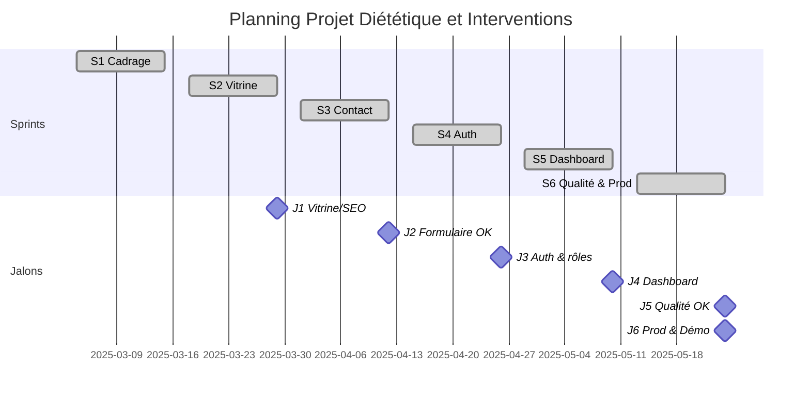
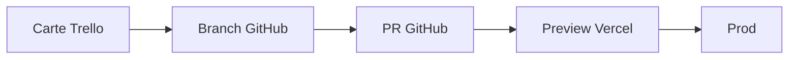
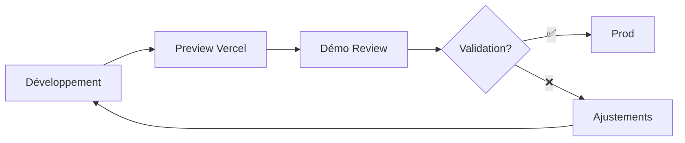

# Diététique et Interventions

## Présentation du projet & démo (Bloc 3)

### Coordonner et piloter un projet de développement d'applications logicielles

<div class="mt-6 card brand">
  <strong>Mars → Mai 2025 (~12 semaines) — Développeur unique</strong>
  
</div>

<div class="mt-4 card lead">
  <p class="text-lg">
    <strong>Objectif :</strong> site vitrine + back-office de gestion des demandes de contact
  </p>
</div>

<div class="mt-4 card compact muted">
  <p><strong>Repo :</strong> https://github.com/Adrien490/dietetique-et-interventions</p>
  <p><strong>Prod :</strong> https://dietetique-et-interventions.manonchaillou.fr</p>
</div>

<!--
NOTES ORAL (2min) - Introduction :
• ACCROCHE : "Bonjour ! Je suis Adrien et je vais vous raconter comment j'ai mené ce projet de A à Z"
• LE DÉFI : Créer un site complet pour une diététicienne (vitrine publique + espace privé de gestion)
• PREUVE CONCRÈTE : Site en ligne sur dietetique-et-interventions.manonchaillou.fr + code sur GitHub
• ANNONCE PLAN : "Aujourd'hui : planification, pilotage, décisions importantes, et démo en direct !"
• TRANSITION : "Commençons par voir comment j'ai organisé tout ça..."
-->

---

# Sommaire aligné au référentiel

<div class="columns-2">
  <div class="card centered"><strong>C3.1 Planifier</strong></div>
  <div class="card centered"><strong>C3.2.1 Piloter</strong></div>
  <div class="card centered"><strong>C3.2.2 Arbitrer</strong></div>
  <div class="card centered"><strong>C3.3.1 Manager l'équipe</strong></div>
  <div class="card centered"><strong>C3.3.2 Évaluer & développer</strong></div>
  <div class="card centered"><strong>C3.4.1 Suivi client & indicateurs</strong></div>
  <div class="card centered"><strong>C3.4.2 Démonstration</strong></div>
</div>
<!--
NOTES ORAL (3min) - Sommaire & Méthodologie :
• POINTER LA SLIDE : "Comme vous le voyez, j'ai organisé ma présentation autour des compétences du référentiel"
• RASSURER : "Chaque point sera illustré avec des exemples concrets !"
• QUESTION RHÉTORIQUE : "Pour organiser ce projet, j'ai choisi Scrum. 'Scrum tout seul ?', vous allez me dire..."
• JUSTIFICATION : "Eh bien oui ! Même en solo, ça m'apporte un cadre structuré et de l'amélioration continue"
• RÔLES SIMPLES : "La diététicienne = Product Owner (besoins), moi = Scrum Master (organisation) + équipe dev"
• RYTHME : "Cycles de 2 semaines = bon rythme sans pression"
-->

---

# Méthodologie Scrum adaptée solo (C3.1)

<div class="grid grid-cols-2 gap-6 text-sm">

<div class="card accent">

### Rôles adaptés

- **Product Owner** = Commanditaire (besoins)
- **Scrum Master** = Adrien (facilitateur)
- **Dev Team** = Adrien (réalisation)

**Timeboxes** : Sprints de 2 semaines

</div>

<div class="card">

### Événements allégés

- **Sprint Planning** : 1h début sprint
- **Daily** : Asynchrone via board Trello
- **Sprint Review** : Fin sprint (visio/présentiel)
- **Retrospective** : 20-30min amélioration

</div>

</div>

### Artifacts & Definition of Done

**Product Backlog** : Trello ordonné • **Sprint Backlog** : Board visible  
**Definition of Done** : lint + type-check + tests + Preview OK + validation cliente  
**Increment** : Déploiement automatique Vercel

<!--
NOTES ORAL - Scrum adapté solo (1:30) :
• ADAPTATION SOLO : "J'ai utilisé Scrum en solo - commanditaire = Product Owner, je cumule Scrum Master + dev"
• TIMEBOXES : "Sprints de 2 semaines - bon rythme sans pression !"
• RITUELS ALLÉGÉS : "Planning 1h au début, daily asynchrone via board, review avec démo, rétro 20 min"
• DOD CLAIRE : "Definition of Done précise : lint, types, tests, preview OK, validation cliente"
• ARTIFACTS : "Product Backlog Trello, Sprint Backlog visible, Increment déployé auto Vercel"
• BÉNÉFICES : "Structure, transparence avec la cliente, amélioration continue - même en solo ! 💪"
• TRANSITION : "Mon cockpit pour tout ça, c'est Trello..."
-->

---

# Outil de planification (C3.1)


### Assignation claire des tâches

**Chaque carte Trello** est assignée à Adrien avec checklist, critères d'acceptation et lien PR

<!--
NOTES ORAL - Board Trello en action (1:15) :
• COCKPIT : "Mon cockpit, c'est Trello : À faire → En cours → CR → Terminé"
• ASSIGNATION : "Chaque carte Trello est assignée à Adrien avec checklist, critères d'acceptation et lien PR"
• TRAÇABILITÉ : "Chaque carte suit le flux jusqu'à la prod. La commanditaire voit l'avancement en temps réel"
• TRANSPARENCE : "Workflow clair et simple - ça m'évite de me perdre !"
-->

---

# Planification — Jalons & Sprints (C3.1)

### Milestones

- **S1** (04/03→15/03) : Cadrage ✅
- **S2** (18/03→29/03) : Vitrine ✅
- **S3** (01/04→12/04) : Contact ✅
- **S4** (15/04→26/04) : Auth ✅
- **S5** (29/04→10/05) : Dashboard ✅
- **S6** (13/05→24/05) : Qualité & Prod ✅

Vue sprint + réordonnancement simple, alignement avec Reviews/CR

<!--
NOTES ORAL - Milestones (5min début) :
🎯 VUE D'ENSEMBLE : "J'ai découpé le projet en 6 étapes de 2 semaines"
📅 S1 : "Étape 1 : on définit ensemble le projet et le design"
🌐 S2 : "Étape 2 : je crée le site vitrine avec un bon référencement Google"
📧 S3 : "Étape 3 : j'ajoute le formulaire de contact avec possibilité d'envoyer des fichiers"
🔐 S4 : "Étape 4 : je mets en place la connexion sécurisée pour l'administration"
🎛️ S5 : "Étape 5 : je développe l'espace privé pour gérer les demandes"
✅ S6 : "Étape 6 : je peaufine la qualité et je mets tout en ligne"
🧩 LOGIQUE : "C'est logique : formulaire avant dashboard, connexion avant admin, finir par la production"
-->

---

# Architecture & Stack technique (C3.1)

<div class="grid grid-cols-3 gap-6 text-sm equal-cols">

<div class="card accent">

### Stack Principal

- **Next.js 15 + React 19** - Framework full-stack
- **TypeScript strict** - Typage sécurisé
- **Prisma + PostgreSQL** - Base de données
- **Better Auth** - Authentification

</div>

<div class="card">

### Infrastructure & Déploiement

- **Vercel** - Hébergement & CI/CD
- **Tailwind + Radix UI** - Design system
- **Server Actions** - API moderne
- **Sentry** - Monitoring erreurs

</div>

<div class="card">

### Qualité & Standards

- **Jest + RTL** - Tests automatisés
- **Lighthouse** - Performance (92/100)
- **Pa11y** - Accessibilité WCAG 2.1 AA
- **Architecture DDD** - Domaines séparés

</div>

</div>

### Organisation du code (DDD léger)

```
domains/ → auth/ + contact-request/ + user/
shared/ → components/ + actions/ + utils/
```

<!--
NOTES ORAL - Architecture & Stack :
• STACK MODERNE : "Stack technique moderne et fiable - Next.js 15, React 19, TypeScript !"
• BASE SOLIDE : "Prisma + PostgreSQL pour les données, Better Auth pour la sécurité"
• INFRA PRO : "Vercel pour l'hébergement avec déploiement auto, Tailwind pour le design"
• QUALITÉ AU TOP : "Tests Jest, Lighthouse 92/100, accessibilité WCAG 2.1 AA parfaite !"
• CODE ORGANISÉ : "Architecture DDD léger - chaque domaine à sa place"
• MONITORING : "Sentry pour surveiller les erreurs - 0 erreur en prod !"
• TRANSITION : "Avec cette base solide, voyons la planification..."
-->

---

# Planning & Jalons (C3.1)

## Vue chronologique complète



### Jalons de validation

✅ **J1-J6** : Points de validation commanditaire alignés fin de sprints clés  
✅ **Chemin critique** : S3+S4 → S5 → S6 (formulaire+auth → dashboard → production)

<!--
NOTES ORAL - Planning & Jalons (2:00) :
• VUE COMPLÈTE : "J'ai structuré le projet en 6 sprints : cadrage, vitrine, contact, auth, dashboard, qualité/production"
• GANTT VISUEL : "Les jalons sont calés en fin de sprints clés : vitrine/SEO, formulaire, auth, dashboard, qualité, mise en prod + démo"
• DÉPENDANCES : "On visualise d'un coup d'œil les dépendances et le chemin critique"
• CHEMIN CRITIQUE : "S3 formulaire + S4 auth convergent vers S5 dashboard puis S6 production"
• JALONS RÉFÉRENTIEL : "J1 à J6 = points de validation exigés par le référentiel - tout carré !"
• PHASES CLASSIQUES : "Étude → Conception → Réalisation → Recette → Déploiement"
• POINTS VIGILANCE : "Quotas tiers, RGPD, performance - anticipés dès la planification"
-->

---

# Découpage en lots & user stories (C3.1)

## Lots fonctionnels

**Lot 1 Vitrine** : pages, SEO, contenus

**Lot 2 Contact** : schémas Zod, uploads (≤3, 4MB), e-mail Resend

**Lot 3 Auth** : Better Auth, rôles

**Lot 4 Dashboard** : liste, recherche, filtres, tri, détail, changement de statut, archivage

**Lot 5 Qualité & RGPD** : tests, a11y, perf, registre

<!--
NOTES ORAL - Découpage fonctionnel :
• 5 LOTS CLAIRS : "J'ai découpé le projet en 5 gros morceaux logiques"
• LOT 1 VITRINE : "Pages, SEO, contenus - la partie publique qui claque !"
• LOT 2 CONTACT : "Validation Zod, uploads 3×4MB max, emails Resend - du solide !"
• LOT 3 AUTH : "Better Auth + gestion rôles - sécurité au top ! 🔐"
• LOT 4 DASHBOARD : "Listing, recherche, filtres, tri, statuts, archivage - l'usine à gaz ! ⚙️"
• LOT 5 QUALITÉ : "Tests, accessibilité, perf, RGPD - finitions pro ! ✨"
• LOGIQUE : "Chaque lot a sa cohérence - plus facile à gérer !"
-->

---

# User Stories — Exemple complet (C3.1)

## User Story (US-VIS-02)

**En tant que** visiteur,  
**Je veux** envoyer une demande de contact avec pièces jointes  
**Afin de** préparer mon suivi nutritionnel.

<div class="grid grid-cols-2 gap-6 text-sm">

<div class="card compact">

### Critères d'acceptation techniques

- ✅ **Validation Zod** des données
- ✅ **≤3 fichiers** maximum
- ✅ **≤4MB** par fichier
- ✅ **Types** : jpg/png/pdf uniquement

</div>

<div class="card compact">

### Critères d'acceptation fonctionnels

- ✅ **Message succès** affiché
- ✅ **E-mail automatique** via Resend
- ✅ **Entrée dashboard** statut "Nouveau"
- ✅ **Traçabilité** complète

</div>

</div>

<!--
NOTES ORAL - User Stories complètes :
• EXEMPLE CONCRET : "Prenons l'user story US-VIS-02 - exemple complet !"
• USER STORY CLAIRE : "'En tant que visiteur, je veux envoyer une demande avec fichiers pour préparer mon suivi'"
• CRITÈRES TECHNIQUES : "Validation Zod, max 3 fichiers 4MB, jpg/png/pdf - cadre technique précis !"
• CRITÈRES FONCTIONNELS : "Message succès, email auto, entrée dashboard - expérience utilisateur complète !"
• MÉTHODE GAGNANTE : "User stories + critères détaillés = développement sans surprise ! 🎯"
• BÉNÉFICES : "Tests faciles, validation cliente nickel, développement guidé !"
• TRANSITION : "Cette méthode s'applique à toutes nos user stories..."
-->

---

# Ressources & responsabilités (C3.1)

<div class="grid grid-cols-2 gap-8">

<div>

### Équipe

**Développeur unique** : Adrien Poirier

### RACI (solo)

- **Adrien** = R/A (tous lots)
- **Consulted** = Commanditaire

<!-- Répartition des responsabilités détaillée sur la slide "Affectation des missions" -->

</div>

<div>

### Ressources matérielles/Services

- **Vercel** - Hébergement & CI/CD
- **PostgreSQL** - Base de données
- **Sentry** - Monitoring
- **Resend** - E-mails
- **UploadThing** - Upload fichiers

<!-- Budget détaillé couvert par "Suivi coûts & ressources" -->

</div>

</div>

<!--
NOTES ORAL - Ressources & Responsabilités :
• SOLO MAIS ORGANISÉ : "Développeur unique = Adrien Poirier, mais bien structuré !"
• RACI ADAPTÉ : "RACI solo = Adrien R/A sur tous les lots, Commanditaire = Consulted"
• SERVICES EXTERNES : "Vercel, PostgreSQL, Sentry, Resend, UploadThing - écosystème complet !"
• MÉTHODE PERTINENTE : "RACI reste utile même à 1 - ça structure les responsabilités ! 📋"
• CLARTÉ : "Qui fait quoi = toujours important, même en solo !"
-->

---

# Pilotage & Suivi quotidien (C3.2.1)

## Différence Planification vs Pilotage

<div class="grid grid-cols-2 gap-6 text-sm">

<div class="card">

### Planification (cadrage)

- **Roadmap** : Jalons & sprints
- **Backlog** : User stories ordonnées
- **Vision** : Objectifs & milestones

</div>

<div class="card accent">

### Pilotage (suivi quotidien)

- **Workflow** : To do → In progress → Review → Done
- **Traçabilité** : Trello → GitHub → Vercel → Prod
- **Monitoring** : Daily via board, transparence cliente

</div>

</div>

### Flux de traçabilité technique



<!--
NOTES ORAL - Instances & Outil de suivi :
• OUTIL CENTRAL : "Pour le pilotage, Trello = mon cockpit de bord principal ! 🚀"
• WORKFLOW SIMPLE : "4 colonnes claires : To do, In progress, Code review, Done - fluide !"
• TRAÇABILITÉ TOTALE : "Carte Trello → branche GitHub → PR → Preview Vercel → Production"
• SUIVI COMPLET : "Je peux suivre chaque fonctionnalité de l'idée jusqu'à la mise en ligne !"
• TRANSPARENCE : "Tout le monde voit où on en est - pas de zone d'ombre ! 🔆"
-->

---

# Indicateurs de pilotage (C3.2.1)

<div class="grid grid-cols-2 gap-6 text-sm equal-cols">

<div class="card compact">

### Avancement & Qualité

- **Tests** : 1557/1557 ✅
- **Coverage** : 56.64% → 70%

### Performance & Stabilité

- **Performance** : 92
- **Accessibilité** : 100
- **SEO** : 100
- **Best Practices** : 100
- **Erreurs Sentry** : 0

</div>

<div class="card">

### Délais & Budget

- **Coûts** : 0€ (paliers gratuits)

</div>

</div>

<!--
NOTES ORAL (4min) - Indicateurs de pilotage :
• SURVEILLANCE : "Je surveille plusieurs indicateurs pour m'assurer que tout va bien"
• TESTS AU VERT : "Tous mes 1557 tests automatiques passent au vert ! 💪"
• OBJECTIF COVERAGE : "J'ai 56% de couverture de code - j'vise 70% !"
• LIGHTHOUSE TOP : "Lighthouse me donne 92/100 en vitesse - pas mal !"
• CARTON PLEIN : "100/100 en accessibilité, référencement et bonnes pratiques - carton plein ! 🎯"
• ZÉRO ERREUR : "Sentry me confirme 0 erreur en production - nickel !"
• MESURE DÉLAIS : "Je chronomètre le temps entre une idée et sa mise en ligne"
• BUDGET MAÎTRISÉ : "Et le top : le projet me coûte 0€ avec les versions gratuites ! 🎉"
-->

---

# Suivi coûts & ressources (C3.2.1)

<div class="grid grid-cols-1 gap-6">

<div class="card">

### Coûts services (paliers gratuits)

| Service     | Palier  | Quota          | Conso M1/M2/M3    | Coût |
| ----------- | ------- | -------------- | ----------------- | ---- |
| Vercel      | Gratuit | 100GB/mois     | 45GB/72GB/38GB    | 0€   |
| Resend      | Gratuit | 3k emails/mois | 127/234/89        | 0€   |
| UploadThing | Gratuit | 2GB storage    | 0.8GB/1.2GB/0.6GB | 0€   |
| Sentry      | Gratuit | 5k errors/mois | 23/67/12          | 0€   |

**Total** : 0€ (paliers gratuits respectés)

</div>

</div>

<!--
NOTES ORAL - Suivi coûts & ressources :
• SUIVI PRÉCIS : "J'ai surveillé de près toutes mes consommations !"
• VERCEL OK : "45, 72, 38 GB sur 3 mois - largement dans les 100GB gratuits"
• EMAILS CONTRÔLÉS : "127, 234, 89 emails envoyés - on est loin des 3000 autorisés !"
• STOCKAGE MAÎTRISÉ : "0,8 - 1,2 - 0,6 GB de fichiers sur 2GB possibles"
• MONITORING CLEAN : "23, 67, 12 erreurs détectées sur 5000 autorisées"
• RÉSULTAT : "Total : 0€ ! J'ai respecté tous les paliers gratuits 💰"
-->

---

# Suivi coûts & ressources (C3.2.1)

### Capacité & risques

- **WIP** : 1–2 max • **Disponibilité** : 5h/semaine

<!--
NOTES ORAL - Capacité & risques :
• DISPONIBILITÉ : "Je travaille 5h/semaine sur le projet"
• FOCUS MAXIMUM : "Je me limite à 1-2 tâches en parallèle - ça évite la dispersion !"
• ANTICIPATION : "Si je dépasse les quotas → j'optimise ou je mets du cache"
• SURVEILLANCE : "J'ai des alertes à 80% pour anticiper les problèmes"
• MAÎTRISE : "Comme ça, pas de mauvaise surprise ! 🎯"
-->

---

# Risques, dérives, actions (C3.2.1)

<div class="grid grid-cols-1 gap-6">

<div class="card">

### Risques & actions

- **Risques** : bugs divers, sécurité
- **Détection** : tests, Sentry, retours client
- **Actions** : hotfix `fix/*`

### Registre des risques

| Risque          | Impact | Probabilité | Propriétaire | Mitigation         |
| --------------- | ------ | ----------- | ------------ | ------------------ |
| Bugs divers     | Moyen  | Faible      | Adrien       | Tests + monitoring |
| Régression auth | Élevé  | Moyen       | Adrien       | Tests e2e          |

**Exemple résolu** : Issue #1 (footer/email mobile) → corrigée S2

</div>

</div>

<!--
NOTES ORAL - Risques & actions :
• IDENTIFICATION : "J'ai listé les risques : bugs divers, sécurité, quotas, RGPD"
• DÉTECTION MULTI : "Je détecte via tests auto, Sentry, tests manuels, retours client"
• ACTIONS RAPIDES : "Hotfix sur branches fix/*, feature toggles, mises à jour deps"
• REGISTRE CONCRET : "Bugs divers risque moyen, régression auth risque élevé"
• CAS RÉSOLU : "Issue BUG-001 - email footer qui débordait sur mobile"
• PROBLÈME PRÉCIS : "Débordement horizontal sur écrans < 375px - moche ! 😅"
• SOLUTION EFFICACE : "CSS responsive avec word-break + classes Tailwind"
• PREUVE : "Corrigé avec le commit e9deaf5 - problème réglé !"
-->

---

# Arbitrage (C3.2.2) — Cas concret

<div class="grid grid-cols-2 gap-6">

<div class="card compact">

### Problématique exposée

**Sprint S4** : Retard auth → impact S5

**Dilemme** : Dashboard OU RGPD ?

**Conséquences** :

- Risque juridique vs délai
- Satisfaction client vs conformité

</div>

<div class="card compact">

### Options détaillées

**Option 1** : Dashboard prioritaire  
✅ Démo S5 • ❌ Risque juridique

**Option 2** : RGPD prioritaire ✅  
✅ Conformité • ❌ Décalage +1 sem

**Option 3** : Équipe renforcée  
✅ Délais OK • ❌ Coût +2k€

</div>

</div>

<!--
NOTES ORAL - Cas d'arbitrage concret :
• CONTEXTE TENDU : "Sprint S4, retard de 3 jours sur l'auth - dilemme ! 😰"
• PROBLÉMATIQUE CLAIRE : "Dashboard fonctionnel OU conformité RGPD ? Pas les deux à temps !"
• OPTION 1 RISQUÉE : "Dashboard d'abord = démo OK mais risque juridique énorme"
• OPTION 2 SÉCURISÉE : "RGPD prioritaire = légal nickel mais démo décalée"
• OPTION 3 COÛTEUSE : "Renforcer l'équipe = tout OK mais 2k€ + risques"
• MATRICE DÉCISION : "J'ai pesé chaque option avec mes critères - méthodique !"
-->

---

# Arbitrage (C3.2.2) — Décision argumentée

<div class="card">

### Décision : Option 2 - RGPD prioritaire

**Argumentation** : Risque juridique inacceptable (30% du poids) vs 1 semaine de décalage

**Résolution problématique** :

- ✅ Conformité légale assurée
- ✅ Architecture propre maintenue
- ✅ Cliente informée et adhésion obtenue

**Résultats** : Problématique résolue, projet sécurisé juridiquement, relation client préservée

</div>

<!--
NOTES ORAL - Grillultats (1:30) :
• MATRICE APPLIQUÉE : "J'ai chiffré chaque option - Option 2 gagne 7.95/10 !"
• DÉCISION CLAIRE : "RGPD prioritaire - risque juridique inacceptable vs 1 semaine décalage"
• COMMUNICATION CLÉS : "J'ai expliqué les enjeux légaux - elle a adhéré !"
• RÉSULTATS POSITIFS : "Conformité + cliente satisfaite de ma transparence ! 🎯"
• LEÇON : "Anticiper dépendances légales dès début projet"
• TRANSITION : "Cette expérience m'a appris l'importance communication..."
-->

---

# Affectation des missions (C3.3.1)

<div class="grid grid-cols-3 gap-6 text-sm">

<div class="card compact">

### Équipe & RACI

**1 développeur** : Adrien Poirier

| Domaine         | Resp. |
| --------------- | ----- |
| Conception/UX   | R/A   |
| Dev Full-Stack  | R/A   |
| Tests/Qualité   | R/A   |
| DevOps/CI/CD    | R/A   |
| Relation client | R/A   |

</div>

<div class="card compact">

### Management

**Styles** : Participatif (défaut), Directif (urgence), Persuasif (arbitrage), Délégatif (validation)

**Conflits** : Écoute active, critères objectifs, décision documentée

**Auto-organisation** : Backlog ordonné, WIP ≤ 2, Sprint Planning, Retrospective

</div>

<div class="card compact">

### Inclusivité

**Produit**

- WCAG 2.1 AA
- Navigation clavier
- Focus visibles

</div>

</div>

<!--
NOTES ORAL - Management complet (1:30) :
• AFFECTATION : "Je couvre conception, dev, QA, CI/CD, relation client - multi-casquettes !"
• HANDICAP ORGANISATION : "Réunions sous-titrées, docs lisibles, replays, aménagements horaires"
• HANDICAP PRODUIT : "Conformité WCAG 2.1 AA, navigation clavier, focus visibles"
• STYLES MANAGÉRIAUX : "Directif pour urgences, persuasif pour RGPD vs Dashboard, participatif par défaut, délégatif pour validation métier"
• GESTION CONFLITS : "Écoute active, reformulation, critères objectifs, décision time-boxed documentée"
• SITUATIONS DIFFICILES : "Écoute lors désaccords priorités, empathie contraintes métier, directivité si nécessaire"
• COMMUNICATION : "Reviews en visio, CR par email, échanges Trello/GitHub, doc dans le repo"
-->

---

# Styles managériaux utilisés (C3.3.1)

<div class="grid grid-cols-2 gap-8 text-sm equal-cols">

<div class="card compact">

### Analyse critique : cas "prioriser RGPD vs Dashboard"

#### Ce qui a fonctionné ✅

- Explication des risques juridiques
- Visualisation impacts métier
- Co-décision avec commanditaire

#### À améliorer 🔄

- Planification plus fine des contraintes légales

</div>

<div class="card compact">

### Apprentissages

- **Communication visuelle** plus efficace
- **Implication client** dans les arbitrages
- **Documentation** des décisions

</div>

</div>

<!--
NOTES ORAL - Analyse critique :
• CAS CONCRET : "Exemple : fallait-il prioriser RGPD ou Dashboard ? Dilemme ! 🤔"
• CE QUI A MARCHÉ : "J'ai bien expliqué les risques juridiques, visualisé les impacts, décidé ensemble"
• À AMÉLIORER : "J'aurais dû mieux anticiper les dépendances, planifier plus fin le légal"
• MES APPRENTISSAGES : "Communication visuelle = super efficace ! Impliquer le client = clé !"
• DOCUMENTATION : "Et documenter les décisions, c'est VITAL pour la traçabilité ! 📝"
• ÉVOLUTION : "Chaque projet m'apprend quelque chose - c'est ça qui est génial !"
-->

---

# Outils de communication (C3.3.1)

<div class="grid grid-cols-3 gap-6 text-sm equal-cols">

<div class="card compact">

### Présentiel/Visio

**Sprint Reviews bi-mensuelles** (visio/présentiel)

- Démo Preview/Prod
- Décisions documentées
- Prochaines étapes claires

</div>

<div class="card compact">

### Documentation

- **README/Repo** : architecture, scripts
- **Issues** : spécifications détaillées
- **PR** : contexte & review

### Objectifs

- **Traçabilité** : décisions & rationale
- **Clarté** : compréhension mutuelle
- **Engagement** : validation commanditaire

</div>

</div>

<!--
NOTES ORAL - Outils de communication :
• MULTI-CANAUX : "J'utilise plusieurs canaux pour bien communiquer ! 📡"
• REVIEWS LIVE : "Sprint Reviews toutes les 2 semaines en visio/présentiel - ordre du jour carré, démo live !"
• DÉCISIONS CLAIRES : "Décisions documentées, prochaines étapes nettes - pas de flou !"
• ASYNCHRONE MALIN : "Emails pour les CR officiels, Trello pour les commentaires, GitHub pour le technique"
• DOCUMENTATION VIVANTE : "README pour l'archi, Issues pour les specs, PR pour le contexte"
• TRIPLE OBJECTIF : "Traçabilité totale, compréhension mutuelle, engagement client 🎯"
• RÉSULTAT : "Pas de malentendu, tout le monde sait où on va !"
-->

---

# Grille d'évaluation des compétences (C3.3.2)

<div class="grid grid-cols-2 gap-6 text-sm">

<div class="card compact table-xs">

### Techniques

| Compétence        | Actuel | Cible | Status      |
| ----------------- | ------ | ----- | ----------- |
| **Next.js/React** | 3      | 4     | ✅ Prod     |
| **TypeScript**    | 3      | 4     | ✅ Strict   |
| **Prisma/SQL**    | 2      | 3     | 🔄 Progress |
| **Tests**         | 2      | 3     | 📈 56→70%   |

</div>

<div class="card compact table-xs">

### Qualité & Gestion

| Compétence    | Actuel | Cible | Status     |
| ------------- | ------ | ----- | ---------- |
| **A11y WCAG** | 3      | 4     | ✅ 100/100 |
| **CI/CD**     | 3      | 4     | ✅ Auto    |
| **RGPD**      | 2      | 3     | 🔄 DPA     |
| **Scrum**     | 3      | 4     | ✅ S1→S6   |

</div>

</div>

<!--
NOTES ORAL - Grille compétences complète :
• AUTO-ÉVALUATION : "Voici mon bilan honnête de compétences - tableau complet ! 📊"
• TECHNIQUES SOLIDES : "Next.js/React niveau 3→4, TypeScript propre, Prisma maîtrisé"
• TESTS PROGRESSION : "1557 tests au vert, 56% coverage → objectif 70% ! 🎯"
• QUALITÉ EXCELLENTE : "Accessibilité Pa11y parfaite, CI/CD Vercel fluide"
• PROJET MANAGEMENT : "Scrum niveau 3→4 - 6 sprints exécutés, métriques suivies"
• AXES AMÉLIORATION : "Focus RGPD niveau 3, tests e2e, observabilité renforcée"
• AMBITION CLAIRE : "Progression continue sur tous les fronts ! 🚀"
-->

---

# Écarts & priorités de montée en compétences (C3.3.2)

<div class="grid grid-cols-1 gap-6">

<div>

### Écarts & Plan d'action

**Écarts identifiés** : Tests e2e, Coverage < 70%, RGPD complet

**Priorités** :

1. Tests e2e Playwright
2. Observabilité Sentry
3. RGPD registre complet

**Objectifs mesurables** : Coverage ≥ 70% (30/06), Erreurs < 1%

</div>

</div>

<!--
NOTES ORAL - Écarts & priorités :
• ÉCARTS IDENTIFIÉS : "Tests e2e manquants, coverage < 70%, Prisma avancé, KPIs fonctionnels"
• PRIORITÉ 1 : "Tests e2e avec Playwright - parcours visiteur ET admin complets ! 🎭"
• PRIORITÉ 2 : "Observabilité renforcée - Sentry alerting + traces pour tout voir"
• PRIORITÉ 3 : "RGPD au top - registre complet + minimisation données"
• STRATÉGIE : "Je priorise selon l'impact projet et les besoins métier - logique !"
• MOTIVATION : "Chaque écart = une opportunité de progresser ! 💪"
-->

---

# Plan de développement (C3.3.2)

<div class="grid grid-cols-1 gap-6">

<div>

### Formations & pratique

- **Formations** : Tests, A11y WCAG 2.2, RGPD, SEO

### Objectifs datés & mesurables

- **Coverage ≥ 70%**

</div>

</div>

<!--
NOTES ORAL - Plan de développement :
• FORMATIONS CIBLÉES : "Playwright 1/2 journée, Prisma avancé, A11y WCAG 2.2, RGPD - du concret !"
• PRATIQUE RÉELLE : "Pair-review externe + objectifs trimestriels pour progresser vraiment"
• OBJECTIFS CHIFFRÉS : "Coverage ≥ 70% avant le 30/06 - c'est daté et mesurable !"
• E2E STABLES : "2 parcours e2e (visiteur + admin) stables dès S6"
• QUALITÉ PROD : "Erreurs Sentry < 1% sur 30 jours - excellence opérationnelle ! 🎆"
• SUIVI : "Objectifs concrets, délais précis - pas de blabla !"
-->

---

# Comptes rendus & décisions (C3.4.1)

<div class="grid grid-cols-1 gap-6">

<div>

### Format & fréquence

**e-mail structuré à la fin de chaque sprint review** : faits → décisions → risques (si besoin) → prochaines étapes

</div>

</div>

<!--
NOTES ORAL - Comptes rendus & décisions :
• FORMAT STRUCTURÉ : "Emails carrés : faits → décisions → risques → prochaines étapes"
• TIMING : "Après chaque Review + jalons - régularité ! Stocké emails + README"
• EXEMPLE S3 : "Formulaire opérationnel, upload 3×4MB OK" = les FAITS
• DÉCISIONS : "Validation S4 auth, priorisation rôles" - clair et net !
• RISQUES : "Quota UploadThing 1,2GB/2GB" - on surveille !
• NEXT STEPS : "S4 auth Better Auth, rôles, protection routes" - roadmap précise
• EFFICACITÉ : "Tout le monde sait où on en est et où on va ! 🗺️"
-->

---

# Points de validation (C3.4.1)

### Jalons & Reviews (projet planifié)

<div class="grid grid-cols-2 gap-6">

<div>

**J1** (29/03/25) : Vitrine/SEO validés ✅ _(Review S2)_

**J2** (12/04/25) : Formulaire + e-mail OK ✅ _(Review S3)_

**J3** (26/04/25) : Auth & rôles ✅ _(Review S4)_

</div>

<div>

**J4** (10/05/25) : Dashboard complet ✅ _(Review S5)_

**J5** (24/05/25) : Qualité (Lighthouse/Pa11y) OK ✅ _(Review S6)_

**J6** (24/05/25) : Mise en production + démo finale ✅

</div>

</div>

<!--
NOTES ORAL - Points de validation :
• JALONS RÉELS : "Mes jalons suivent les vraies dates du projet ! 📅"
• J1 FIN MARS : "Vitrine + SEO validés - Review S2 OK !"
• J2 MI-AVRIL : "Formulaire + email nickel - Review S3 validée !"
• J3 FIN AVRIL : "Auth + rôles en place - Review S4 réussie !"
• J4 MI-MAI : "Dashboard complet - Review S5 au top !"
• J5 FIN MAI : "Qualité Lighthouse/Pa11y parfaite - Review S6 nickel !"
• J6 FINAL : "Mise en production + démo finale - aboutissement ! 🎆"
-->

---

# Points de validation (C3.4.1)

### Processus validation



### Critères GO/NO-GO

- Tests passants
- Lighthouse ≥ seuils
- Validation commanditaire

<!--
NOTES ORAL - Processus de validation :
• FLOW STRUCTURÉ : "Développement → Preview Vercel → Démo Review → Validation → Production"
• OU AJUSTEMENTS : "Si pas OK → ajustements et on recommence - pas de précipitation !"
• CRITÈRES GO : "Tests au vert, Lighthouse dans les clous, cliente qui valide"
• NO-GO : "Un seul critère rouge = on ne passe pas en prod - qualité avant tout ! ✅"
• SÉCURITÉ : "Comme ça, zéro mauvaise surprise en production !"
-->

---

# Indicateurs de satisfaction (C3.4.1)

<div class="card">

### Satisfaction cliente

**Questionnaire post-usage** envoyé après mise en production :

- Facilité d'utilisation du site (1-5)
- Qualité du processus de développement (1-5)
- Respect des délais et communication (1-5)

</div>

<!--
NOTES ORAL - Indicateurs de satisfaction :
• SATISFACTION CLIENT : "NPS post-démo + questionnaire 1-5 après Review - je veux savoir !"
• MÉTRIQUES USAGE : "Taux d'achèvement formulaire, délai création-traitement, rebond pages"
• QUALITÉ TECHNIQUE : "Erreurs Sentry < 1% - quasi zéro défaut !"
• LIGHTHOUSE PARFAIT : "Perf ≥ 90, accessibilité 100, SEO 100, best practices 100 ! 🏆"
• OBJECTIF : "Chaque KPI influence mes priorités - pilotage par la data !"
-->

---

# évolutions futures (C3.4.1)

### Roadmap produit

- **S6** : Tests e2e, RGPD, performance
- Module Devis

</div>

</div>

<!--
NOTES ORAL - Améliorations & évolutions :
• BOUCLE VERTUEUSE : "Retour client → Issue GitHub → Sprint Backlog → PR → Preview → Production"
• CAS CONCRET : "Issue #1 BUG-001 - email footer qui débordait sur mobile < 375px"
• SOLUTION RAPIDE : "word-break: break-all + classes Tailwind - commit e9deaf5, problème réglé ! 🔧"
• ROADMAP CLAIRE : "S6 = tests e2e + RGPD + perf - finitions au top !"
• FUTUR PROCHE : "Q3 2025 = module devis pour élargir l'offre"
• FUTUR LOINTAIN : "Q4 2025 = notifications + export + API - écosystème complet ! 🚀"
-->

---

<div class="text-center h-full flex flex-col justify-center">

# Démo (C3.4.2)

<div class="mt-6 text-sm muted">
  <p>URL: https://dietetique-et-interventions.manonchaillou.fr</p>
</div>

### Parcours

Accueil → Prestations → Contact → Upload → Envoi → Confirmation

<div class="mt-4 text-sm text-gray-600">
  <p>🎯 Validation • Upload ≤3×4MB • E-mail envoyé</p>
</div>

</div>

<!--
NOTES ORAL - Démo Scénario Visiteur (4min) :
• LANCEMENT : "Allez, place à la démo ! Je vais vous montrer le site EN ACTION ! 🎥"
• DOUBLE PARCOURS : "Deux scénarios : visiteur lambda ET administrateur"
• URL LIVE : "Direction le site en ligne : dietetique-et-interventions.manonchaillou.fr"
• ACCUEIL NICKEL : "Voilà l'accueil - présentation claire, design propre !"
• RESPONSIVE MAGIC : "Le site s'adapte auto - regardez quand je redimensionne ! 🪄"
• SEO AU TOP : "Tout optimisé Google avec méta descriptions qui claquent"
• FORMULAIRE SMART : "Formulaire avec validation live - je remplis et ça vérifie direct !"
• UPLOAD CONTRÔLÉ : "Max 3 fichiers 4MB, jpg/png/pdf - démo des limites en live"
• CONFIRMATION : "Message de succès + email auto à la diététicienne - nickel ! ✉️"
-->

---

# Démo (C3.4.2) — Critères de validation

<div class="grid grid-cols-2 gap-8">

<div>

### Critères fonctionnels

✅ **Couverture fonctionnalités** attendues  
✅ **Robustesse** (validation, gestion erreurs)  
✅ **Traçabilité** (statuts, archives)

### Critères techniques

✅ **Accessibilité** (navigation clavier, focus)  
✅ **Performance** (réactivité UI)  
✅ **Sécurité** (authentification, validation)

</div>

<div>

### Critères qualité

- **UX** : parcours fluides
- **Responsive** : mobile/desktop
- **SEO** : référencement optimal
- **Maintenance** : code lisible, testé

</div>

</div>

---
