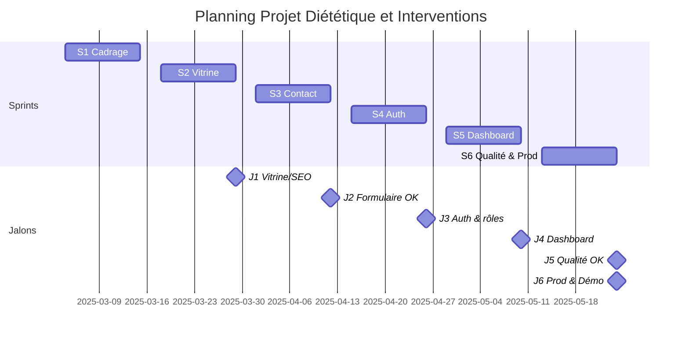
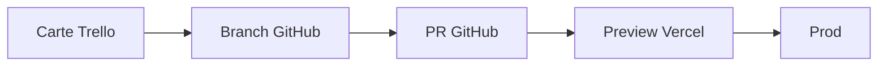
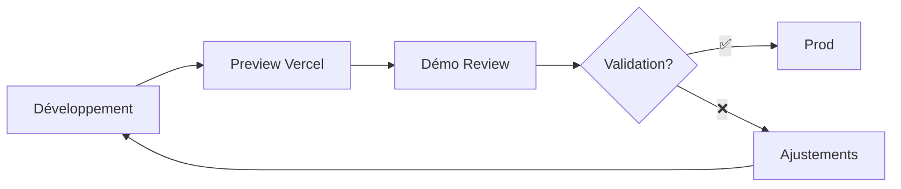

# Diététique et Interventions

## Présentation du projet & démo (Bloc 3)

### Coordonner et piloter un projet de développement d'applications logicielles

<div class="mt-6 card brand">
  <strong>Mars → Juin 2025 (3 mois) — Développeur unique</strong>
  
</div>

<div class="mt-4 card lead">
  <p class="text-lg">
    <strong>Objectif :</strong> site vitrine + back-office de gestion des demandes de contact
  </p>
</div>

<div class="mt-4 card compact muted">
  <p><strong>Repo :</strong> https://github.com/Adrien490/dietetique-et-interventions</p>
  <p><strong>Prod :</strong> https://dietetique-et-interventions.manonchaillou.fr</p>
</div>

<!--
NOTES ORAL (2min) - Introduction :
• ACCROCHE : "Bonjour ! Je suis Adrien et je vais vous raconter comment j'ai mené ce projet de A à Z"
• LE DÉFI : Créer un site complet pour une diététicienne (vitrine publique + espace privé de gestion)
• PREUVE CONCRÈTE : Site en ligne sur dietetique-et-interventions.manonchaillou.fr + code sur GitHub
• ANNONCE PLAN : "Aujourd'hui : planification, pilotage, décisions importantes, et démo en direct !"
• TRANSITION : "Commençons par voir comment j'ai organisé tout ça..."
-->

---

# Sommaire aligné au référentiel

<div class="columns-2">
  <div class="card centered"><strong>C3.1 Planifier</strong></div>
  <div class="card centered"><strong>C3.2.1 Piloter</strong></div>
  <div class="card centered"><strong>C3.2.2 Arbitrer</strong></div>
  <div class="card centered"><strong>C3.3.1 Manager l'équipe</strong></div>
  <div class="card centered"><strong>C3.3.2 Évaluer & développer</strong></div>
  <div class="card centered"><strong>C3.4.1 Suivi client & indicateurs</strong></div>
  <div class="card centered"><strong>C3.4.2 Démonstration</strong></div>
</div>
<!--
NOTES ORAL (3min) - Sommaire & Méthodologie :
• POINTER LA SLIDE : "Comme vous le voyez, j'ai organisé ma présentation autour des compétences du référentiel"
• RASSURER : "Chaque point sera illustré avec des exemples concrets !"
• QUESTION RHÉTORIQUE : "Pour organiser ce projet, j'ai choisi Scrum. 'Scrum tout seul ?', vous allez me dire..."
• JUSTIFICATION : "Eh bien oui ! Même en solo, ça m'apporte un cadre structuré et de l'amélioration continue"
• RÔLES SIMPLES : "La diététicienne = Product Owner (besoins), moi = Scrum Master (organisation) + équipe dev"
• RYTHME : "Cycles de 2 semaines = bon rythme sans pression"
-->

---

# Méthodologie choisie (C3.1) — Scrum

## Approche Agile Scrum adaptée à un développeur unique

**Timeboxes sprints :** 2 semaines

### Rôles

- **Product Owner** = commanditaire
- **Scrum Master** = Adrien (facilitateur)
- **Dev Team** = Adrien

<!--
NOTES ORAL - Rôles Scrum adaptés :
🎯 CONTEXTE : "Concrètement, j'ai réparti les rôles même en solo"
👩‍💼 PRODUCT OWNER : "La diététicienne devient la 'Product Owner' - elle définit les besoins"
🎪 DOUBLE CASQUETTE : "Moi, je joue à la fois le 'Scrum Master' qui organise, et l'équipe de développement qui code"
📅 TIMEBOXING : "Je travaille par cycles de 2 semaines - ça donne un bon rythme sans me mettre trop de pression"
💪 BÉNÉFICES : "Même en solo, ça m'apporte structure, transparence et amélioration continue"
➡️ TRANSITION : "Voyons maintenant comment j'organise ces cycles..."
-->

---

# Méthodologie choisie (C3.1) — Scrum — Événements

### Événements

| Événement                | Format               | Durée     | Objectif                        |
| ------------------------ | -------------------- | --------- | ------------------------------- |
| **Sprint Planning**      | Début sprint         | 1h        | Objectif sprint, sprint backlog |
| **Daily**                | Asynchrone via board | 5 min     | Blocages, priorités du jour     |
| **Sprint Review**        | Hebdo présentiel     | -         | Démo increment Preview/Prod     |
| **Sprint Retrospective** | Fin de sprint        | 20-30 min | Amélioration processus          |

<!--
NOTES ORAL - Événements Scrum adaptés :
📋 PLANNING : "Je planifie chaque cycle en 1 heure - objectif + tâches à faire"
📱 DAILY MALIN : "Je fais le point quotidien via mon tableau Trello plutôt qu'en réunion - évite la surcharge !"
🎥 REVIEWS CLÉS : "Je présente les avancées chaque semaine à la cliente - maintient l'alignement"
🔄 RÉTRO UTILE : "Je prends 20-30 minutes en fin de cycle pour réfléchir à ce qui peut être amélioré"
💡 ADAPTATION : "Tous les rituels Scrum, mais adaptés à ma sauce pour du solo efficace"
➡️ TRANSITION : "Et pour organiser tout ça, j'ai mes outils..."
-->

---

# Méthodologie choisie (C3.1) — Scrum

### Artifacts

- **Product Backlog** : Trello
- **Sprint Backlog** : Board
- **Definition of Done** : lint + type-check + tests + Preview OK + CR client
- **Increment** : déploiement Vercel

✅ Transparence • Amélioration continue

<!--
NOTES ORAL - Artifacts Scrum :
📝 PRODUCT BACKLOG : "J'utilise Trello pour gérer mes tâches - ma liste de souhaits ordonnée"
📊 SPRINT BACKLOG : "Chaque cycle, je sélectionne les tâches dans mon tableau visible"
✅ DEFINITION OF DONE : "J'ai défini des critères clairs pour dire qu'une fonctionnalité est 'finie' : tests OK, cliente validée"
🚀 INCREMENT : "Chaque nouvelle version se déploie automatiquement sur internet via Vercel"
🎯 RÉSULTAT : "Ça me donne transparence et amélioration continue, même en solo !"
➡️ TRANSITION : "Maintenant, voyons comment je planifie concrètement..."
-->

---

# Outil de planification (C3.1)


<!--
NOTES ORAL - Board Trello en action :
📱 PRÉSENTATION : "Voici le board que j'utilise quotidiennement - mon cockpit de projet !"
🏗️ STRUCTURE : "À faire, En cours, En test, Terminé - workflow clair et simple"
🔍 TRAÇABILITÉ : "Chaque carte suit son parcours complet de l'idée à la production"
👀 TRANSPARENCE : "La cliente peut voir l'avancement en temps réel"
💪 EFFICACITÉ : "Ça m'évite de me perdre et ça rassure tout le monde !"
-->

---

# Outil de planification (C3.1)

### Milestones

- **S1** (04/03→15/03) : Cadrage
- **S2** (18/03→29/03) : Vitrine
- **S3** (01/04→12/04) : Contact
- **S4** (15/04→26/04) : Auth
- **S5** (29/04→10/05) : Dashboard
- **S6** (13/05→24/05) : Qualité & Prod

Vue sprint + réordonnancement simple, alignement avec Reviews/CR

<!--
NOTES ORAL - Milestones (5min début) :
🎯 VUE D'ENSEMBLE : "J'ai découpé le projet en 6 étapes de 2 semaines"
📅 S1 : "Étape 1 : on définit ensemble le projet et le design"
🌐 S2 : "Étape 2 : je crée le site vitrine avec un bon référencement Google"
📧 S3 : "Étape 3 : j'ajoute le formulaire de contact avec possibilité d'envoyer des fichiers"
🔐 S4 : "Étape 4 : je mets en place la connexion sécurisée pour l'administration"
🎛️ S5 : "Étape 5 : je développe l'espace privé pour gérer les demandes"
✅ S6 : "Étape 6 : je peaufine la qualité et je mets tout en ligne"
🧩 LOGIQUE : "C'est logique : formulaire avant dashboard, connexion avant admin, finir par la production"
-->

---

# Architecture & stack (C3.1)

<div class="grid grid-cols-2 gap-8 text-sm equal-cols">

<div class="card">

### Front-end

- **Next.js 15** - Framework React
- **React 19** - Interface utilisateur
- **TypeScript strict** - Typage fort
- **Tailwind CSS** - Styling
- **Radix UI + shadcn/ui** - Composants

### Back-end

- **Server Actions** + API Routes
- **Prisma ORM** - Base de données

 </div>

</div>

<!--
NOTES ORAL - Architecture & Stack (1/2) :
🔧 INTRODUCTION : "Côté technique, j'ai choisi des technologies modernes et fiables"
💻 FRONTEND : "Next.js et React - des outils très populaires pour créer des sites web interactifs"
🛡️ SÉCURITÉ : "J'ai ajouté TypeScript pour éviter les erreurs de code"
🎨 DESIGN : "Tailwind CSS pour un design propre et responsive"
🧩 COMPOSANTS : "Radix UI avec shadcn/ui pour des composants réutilisables"
⚡ BACKEND : "Server Actions Next.js + API Routes pour la partie serveur"
🗃️ DATA : "Prisma ORM + PostgreSQL pour stocker les données"
➡️ TRANSITION : "Et pour l'infrastructure..."
-->

---

# Architecture & stack (C3.1)

<div class="grid grid-cols-3 gap-6 text-sm equal-cols">

<div class="card accent">

### Infrastructure

- **PostgreSQL** - Base de données
- **Better Auth** - Authentification
- **Vercel** - Hébergement & CI/CD

</div>

<div class="card">

### Qualité & Observabilité

- **Jest + RTL** - Tests
- **Lighthouse** - Performance
- **Pa11y** - Accessibilité
- **Sentry** - Monitoring

</div>

<div class="card">

- **Performance** : SSR/SSG optimisé
- **Sécurité** : TypeScript + validation Zod
- **Accessibilité** : WCAG 2.1 AA
- **Observabilité** : Erreurs & métriques temps réel

</div>

</div>

<!--
NOTES ORAL - Architecture & Stack (2/2) - Infrastructure & Qualité :
🌐 HÉBERGEMENT : "Vercel pour héberger le site - déploiement automatique à chaque mise à jour"
🔐 AUTHENTIFICATION : "Better Auth pour la connexion sécurisée + PostgreSQL pour stocker les données"
🧪 QUALITÉ : "Jest avec React Testing Library pour tester automatiquement mon code"
⚡ PERFORMANCE : "Lighthouse pour mesurer la vitesse du site"
♿ ACCESSIBILITÉ : "Pa11y pour vérifier que le site est accessible à tous"
🚨 MONITORING : "Sentry pour surveiller les erreurs en temps réel"
🛡️ SÉCURITÉ : "TypeScript + validation Zod pour éviter les failles"
🏆 STANDARDS : "Tout respecte WCAG 2.1 AA pour l'accessibilité"
➡️ TRANSITION : "Cette architecture me permet de découper le projet en grandes parties..."
-->

---

# Architecture logique (C3.1)

## DDD léger : séparation par domaines

```
src/
├── app/              # Routes & layouts Next.js
├── domains/          # Logique métier
│   ├── auth/         # Authentification
│   ├── contact-request/  # Demandes de contact
│   └── user/         # Gestion utilisateurs
├── shared/           # Code partagé
│   ├── components/   # UI components
│   ├── actions/      # Server actions
│   ├── hooks/        # Hooks React
│   ├── utils/        # Utilitaires
│   └── schemas/      # Schémas Zod
└── prisma/           # Base de données
```

<!--
NOTES ORAL - Architecture logique DDD :
🏗️ ORGANISATION : "J'ai organisé le code en domaines logiques - du Domain-Driven Design léger"
🔐 AUTH : "Domaine 'Auth' = tout ce qui concerne la connexion et les rôles"
📧 CONTACT-REQUEST : "Domaine 'Contact-Request' = gestion des demandes des visiteurs"
👤 USER : "Domaine 'User' = profils et données utilisateurs"
🤝 SHARED : "Dossier 'Shared' = composants et utilitaires communs"
💡 AVANTAGE : "Code bien rangé, chaque chose à sa place !"
🔧 MAINTENANCE : "Plus facile à maintenir et faire évoluer"
➡️ TRANSITION : "Maintenant, voyons comment j'ai planifié les sprints..."
-->

---

# Planning détaillé (C3.1) — Sprints S1→S6

<div class="text-sm card">

| Sprint | Dates       | Objectifs                                              |
| ------ | ----------- | ------------------------------------------------------ |
| **S1** | 04/03→15/03 | Cadrage fonctionnel, design, contenus vitrine          |
| **S2** | 18/03→29/03 | Vitrine + SEO                                          |
| **S3** | 01/04→12/04 | Formulaire contact (validation, upload ≤3×4MB, e-mail) |
| **S4** | 15/04→26/04 | Authentification + rôles                               |
| **S5** | 29/04→10/05 | Dashboard admin (listing, filtres, statuts, archivage) |
| **S6** | 13/05→24/05 | Qualité (tests, a11y, perf), RGPD, mise en production  |

</div>

<!--
NOTES ORAL - Planning détaillé Sprints :
• TABLEAU COMPLET : "Voici le détail de mes 6 sprints avec dates et objectifs précis !"
• S1 CADRAGE : "Sprint 1 = on pose les bases : projet + design ensemble"
• S2 VITRINE : "Sprint 2 = je crée le site public + SEO pour Google"
• S3 CONTACT : "Sprint 3 = formulaire avec upload de fichiers - technique !"
• S4 CONNEXION : "Sprint 4 = authentification sécurisée + gestion des rôles"
• S5 DASHBOARD : "Sprint 5 = espace admin complet - le cœur du système !"
• S6 FINITIONS : "Sprint 6 = qualité, RGPD et mise en production - la touche finale ! 🏁"
-->

---

# Retroplanning & Jalons (C3.1)

## Vue chronologique des sprints et jalons



<!--
NOTES ORAL - Retroplanning & Jalons :
• VUE CHRONOLOGIQUE : "Voici la vue d'ensemble sur 3 mois - tout est planifié ! 📅"
• RYTHME RÉGULIER : "6 sprints de 2 semaines avec jalons de validation cliente"
• JALONS OFFICIELS : "J1 à J6 = les points de validation exigés par le référentiel - carré !"
• DISTINCTION CLAIRE : "Sprints = je bosse, jalons = on valide ensemble"
• CHEMIN CRITIQUE : "S3→S5, S4→S5 - tout converge vers la production finale ! 🎯"
• VISIBILITÉ TOTALE : "Avec ce Gantt, on voit tout d'un coup d'œil !"
-->

---

# Découpage en lots & user stories (C3.1)

## Lots fonctionnels

**Lot 1 Vitrine** : pages, SEO, contenus

**Lot 2 Contact** : schémas Zod, uploads (≤3, 4MB), e-mail Resend

**Lot 3 Auth** : Better Auth, rôles

**Lot 4 Dashboard** : liste, recherche, filtres, tri, détail, changement de statut, archivage

**Lot 5 Qualité & RGPD** : tests, a11y, perf, registre

<!--
NOTES ORAL - Découpage fonctionnel :
• 5 LOTS CLAIRS : "J'ai découpé le projet en 5 gros morceaux logiques"
• LOT 1 VITRINE : "Pages, SEO, contenus - la partie publique qui claque !"
• LOT 2 CONTACT : "Validation Zod, uploads 3×4MB max, emails Resend - du solide !"
• LOT 3 AUTH : "Better Auth + gestion rôles - sécurité au top ! 🔐"
• LOT 4 DASHBOARD : "Listing, recherche, filtres, tri, statuts, archivage - l'usine à gaz ! ⚙️"
• LOT 5 QUALITÉ : "Tests, accessibilité, perf, RGPD - finitions pro ! ✨"
• LOGIQUE : "Chaque lot a sa cohérence - plus facile à gérer !"
-->

---

# User Stories — Exemple détaillé (C3.1)

## User Story (US-VIS-02)

**En tant que** visiteur,  
**Je veux** envoyer une demande de contact avec pièces jointes  
**Afin de** préparer mon suivi.

### Critères d'acceptation

- ✅ Validation Zod
- ✅ ≤3 fichiers
- ✅ Chaque fichier ≤4MB
- ✅ Types acceptés (jpg/png/pdf)

<!--
NOTES ORAL - User Stories exemple (1/2) :
• EXEMPLE CONCRET : "Prenons l'user story US-VIS-02 - du concret !"
• USER STORY : "'En tant que visiteur, je veux envoyer une demande avec fichiers pour préparer mon suivi'"
• CRITÈRES PRÉCIS : "Les critères d'acceptation sont ultra-précis - pas de flou !"
• VALIDATION TECHNIQUE : "Validation Zod des données - sécurité avant tout !"
• LIMITES CLAIRES : "Max 3 fichiers, 4MB chacun, jpg/png/pdf seulement"
• CADRE NET : "Comme ça, tout le monde sait ce qui est attendu ! 🎯"
-->

---

# User Stories — Exemple détaillé (C3.1)

### Critères d'acceptation (suite)

- ✅ Message succès
- ✅ E-mail Resend reçu
- ✅ Entrée visible en dashboard statut = "Nouveau"

<!--
NOTES ORAL - User Stories suite (2/2) :
• SUITE CRITÈRES : "Et ce n'est pas fini - suite des critères !"
• MESSAGE SUCCÈS : "Message de succès affiché - feedback utilisateur !"
• EMAIL AUTO : "Email Resend reçu par la diététicienne - notification immédiate !"
• DASHBOARD SYNC : "Entrée visible dans le dashboard statut 'Nouveau' - traçabilité totale !"
• MÉTHODE GAGNANTE : "User stories + critères précis = tests faciles + validation cliente nickel ! 🏆"
• EFFICACITÉ : "Pas de surprise, tout est cadré dès le départ !"
-->

---

# Ressources & responsabilités (C3.1)

<div class="grid grid-cols-2 gap-8">

<div>

### Équipe

**Développeur unique** : Adrien Poirier

### RACI (solo)

- **Adrien** = R/A (tous lots)
- **Consulted** = Commanditaire

<!-- Répartition des responsabilités détaillée sur la slide "Affectation des missions" -->

</div>

<div>

### Ressources matérielles/Services

- **Vercel** - Hébergement & CI/CD
- **PostgreSQL** - Base de données
- **Sentry** - Monitoring
- **Resend** - E-mails
- **UploadThing** - Upload fichiers

<!-- Budget détaillé couvert par "Suivi coûts & ressources" -->

</div>

</div>

<!--
NOTES ORAL - Ressources & Responsabilités :
• SOLO MAIS ORGANISÉ : "Développeur unique = Adrien Poirier, mais bien structuré !"
• RACI ADAPTÉ : "RACI solo = Adrien R/A sur tous les lots, Commanditaire = Consulted"
• SERVICES EXTERNES : "Vercel, PostgreSQL, Sentry, Resend, UploadThing - écosystème complet !"
• MÉTHODE PERTINENTE : "RACI reste utile même à 1 - ça structure les responsabilités ! 📋"
• CLARTÉ : "Qui fait quoi = toujours important, même en solo !"
-->

---

# Validation C3.1 — Synthèse des preuves

## Planifier l'exécution du projet ✅

<div class="grid grid-cols-2 gap-6 text-sm">

<div class="card compact">

### Méthodologie & Outils

- **Scrum adapté solo** : rôles/événements/artéfacts
- **Trello** : release plan, milestones S1→S6
- **Retroplanning Gantt** : vue chronologique + jalons

### Découpage & Architecture

- **5 lots fonctionnels** + user stories + critères
- **Architecture stack** détaillée (3 slides)
- **DDD léger** par domaines

</div>

<div class="card compact">

### Planning & Ressources

- **Planning détaillé** S1→S6 avec dépendances
- **Chemin critique** : S3→S5, S4→S5
- **Ressources identifiées** : Vercel, PostgreSQL, Sentry...
- **RACI solo** : R/A tous domaines

### Inclusivité

- **Accessibilité produit** : WCAG 2.1 AA
- **Organisation inclusive** : docs, enregistrements, sous-titres

</div>

</div>

<!--
NOTES ORAL - Validation C3.1 :
• BILAN COMPÉTENCE : "Voilà mon bilan pour C3.1 'Planifier l'exécution du projet' ! 📊"
• SCRUM COMPLET : "Méthodologie Scrum adaptée avec TOUS les éléments : rôles, événements, artéfacts"
• OUTILS PRO : "Trello + Gantt visuel - planification de chef de projet ! 🗺️"
• DÉCOUPAGE NICKEL : "Lots + user stories + critères d'acceptation - tout est cadré !"
• ARCHITECTURE SOLIDE : "Architecture technique ET logique détaillées - du sérieux !"
• PLANNING MAÎTRISÉ : "Dépendances + chemin critique identifiés - pas de surprise !"
• INCLUSIVITÉ : "Ressources + RACI + prise en compte handicap - approche complète ! 🌈"
• MISSION ACCOMPLIE : "C3.1 validé avec des preuves béton !"
-->

---

# Instances & outil de suivi (C3.2.1)

## Instances Scrum

<div class="grid grid-cols-2 gap-6 text-sm">

<div class="card">

### Outil de suivi : Trello

- **Colonnes** : To do / In progress / Code review / Done

</div>

<div class="card">

### Traçabilité



### Cohérence méthodologique

- Daily adapté via board
- Transparence avec la diététicienne

</div>

</div>

<!--
NOTES ORAL - Instances & Outil de suivi :
• OUTIL CENTRAL : "Pour le pilotage, Trello = mon cockpit de bord principal ! 🚀"
• WORKFLOW SIMPLE : "4 colonnes claires : To do, In progress, Code review, Done - fluide !"
• TRAÇABILITÉ TOTALE : "Carte Trello → branche GitHub → PR → Preview Vercel → Production"
• SUIVI COMPLET : "Je peux suivre chaque fonctionnalité de l'idée jusqu'à la mise en ligne !"
• TRANSPARENCE : "Tout le monde voit où on en est - pas de zone d'ombre ! 🔆"
-->

---

# Indicateurs de pilotage (C3.2.1)

<div class="grid grid-cols-2 gap-6 text-sm equal-cols">

<div class="card compact">

### Avancement & Qualité

- **Tests** : 1557/1557 ✅
- **Coverage** : 56.64% → 70%

### Performance & Stabilité

- **Performance** : 92
- **Accessibilité** : 100
- **SEO** : 100
- **Best Practices** : 100
- **Erreurs Sentry** : 0

</div>

<div class="card">

### Délais & Budget

- **Cycle time** : issue → prod (Y jours)
- **Coûts** : 0€ (paliers gratuits)

</div>

</div>

<!--
NOTES ORAL (4min) - Indicateurs de pilotage :
• SURVEILLANCE : "Je surveille plusieurs indicateurs pour m'assurer que tout va bien"
• TESTS AU VERT : "Tous mes 1557 tests automatiques passent au vert ! 💪"
• OBJECTIF COVERAGE : "J'ai 56% de couverture de code - j'vise 70% !"
• LIGHTHOUSE TOP : "Lighthouse me donne 92/100 en vitesse - pas mal !"
• CARTON PLEIN : "100/100 en accessibilité, référencement et bonnes pratiques - carton plein ! 🎯"
• ZÉRO ERREUR : "Sentry me confirme 0 erreur en production - nickel !"
• MESURE DÉLAIS : "Je chronomètre le temps entre une idée et sa mise en ligne"
• BUDGET MAÎTRISÉ : "Et le top : le projet me coûte 0€ avec les versions gratuites ! 🎉"
-->

---

# Suivi coûts & ressources (C3.2.1)

<div class="grid grid-cols-1 gap-6">

<div class="card">

### Coûts services (paliers gratuits)

| Service     | Palier  | Quota          | Conso M1/M2/M3    | Coût |
| ----------- | ------- | -------------- | ----------------- | ---- |
| Vercel      | Gratuit | 100GB/mois     | 45GB/72GB/38GB    | 0€   |
| Resend      | Gratuit | 3k emails/mois | 127/234/89        | 0€   |
| UploadThing | Gratuit | 2GB storage    | 0.8GB/1.2GB/0.6GB | 0€   |
| Sentry      | Gratuit | 5k errors/mois | 23/67/12          | 0€   |

**Total** : 0€ (paliers gratuits respectés)

</div>

</div>

<!--
NOTES ORAL - Suivi coûts & ressources :
• SUIVI PRÉCIS : "J'ai surveillé de près toutes mes consommations !"
• VERCEL OK : "45, 72, 38 GB sur 3 mois - largement dans les 100GB gratuits"
• EMAILS CONTRÔLÉS : "127, 234, 89 emails envoyés - on est loin des 3000 autorisés !"
• STOCKAGE MAÎTRISÉ : "0,8 - 1,2 - 0,6 GB de fichiers sur 2GB possibles"
• MONITORING CLEAN : "23, 67, 12 erreurs détectées sur 5000 autorisées"
• RÉSULTAT : "Total : 0€ ! J'ai respecté tous les paliers gratuits 💰"
-->

---

# Suivi coûts & ressources (C3.2.1)

### Capacité & risques

- **WIP** : 1–2 max • **Disponibilité** : 5h/semaine

<!--
NOTES ORAL - Capacité & risques :
• DISPONIBILITÉ : "Je travaille 5h/semaine sur le projet"
• FOCUS MAXIMUM : "Je me limite à 1-2 tâches en parallèle - ça évite la dispersion !"
• ANTICIPATION : "Si je dépasse les quotas → j'optimise ou je mets du cache"
• SURVEILLANCE : "J'ai des alertes à 80% pour anticiper les problèmes"
• MAÎTRISE : "Comme ça, pas de mauvaise surprise ! 🎯"
-->

---

# Risques, dérives, actions (C3.2.1)

<div class="grid grid-cols-1 gap-6">

<div class="card">

### Risques & actions

- **Risques** : bugs divers, sécurité
- **Détection** : tests, Sentry, retours client
- **Actions** : hotfix `fix/*`, feature toggle, patch deps

### Registre des risques

| Risque          | Impact | Probabilité | Propriétaire | Mitigation         |
| --------------- | ------ | ----------- | ------------ | ------------------ |
| Bugs divers     | Moyen  | Faible      | Adrien       | Tests + monitoring |
| Régression auth | Élevé  | Moyen       | Adrien       | Tests e2e          |

**Exemple résolu** : Issue #1 (footer/email mobile) → corrigée S2

### Détail Issue BUG-001

**[BUG-001] Affichage email footer décale le contenu sur mobile**

- **Problème** : L'email dans le footer provoque un débordement horizontal sur mobile (< 375px)
- **Impact** : Scroll horizontal indésirable, dégradation UX mobile
- **Solution** : CSS responsive avec `word-break: break-all` et classes Tailwind `break-all`
- **Statut** : ✅ Fermée (commit e9deaf5)
- **Environnement** : Tous navigateurs, iOS/Android, smartphones < 375px

</div>

</div>

<!--
NOTES ORAL - Risques & actions :
• IDENTIFICATION : "J'ai listé les risques : bugs divers, sécurité, quotas, RGPD"
• DÉTECTION MULTI : "Je détecte via tests auto, Sentry, tests manuels, retours client"
• ACTIONS RAPIDES : "Hotfix sur branches fix/*, feature toggles, mises à jour deps"
• REGISTRE CONCRET : "Bugs divers risque moyen, régression auth risque élevé"
• CAS RÉSOLU : "Issue BUG-001 - email footer qui débordait sur mobile"
• PROBLÈME PRÉCIS : "Débordement horizontal sur écrans < 375px - moche ! 😅"
• SOLUTION EFFICACE : "CSS responsive avec word-break + classes Tailwind"
• PREUVE : "Corrigé avec le commit e9deaf5 - problème réglé !"
-->

---

# Arbitrage (C3.2.2) — Méthodologie & Critères

## Approche structurée

**Critères d'aide à la décision** : Délai • Couverture besoin (≥95%) • Risque technique • Dette • Impact UX • Coût

### Processus d'arbitrage

1. **Identification** du problème/contrainte
2. **Analyse** des options possibles
3. **Évaluation** selon critères définis
4. **Décision** documentée et communiquée
5. **Suivi** des impacts et ajustements

### Principes

- **Transparence** avec la commanditaire
- **Documentation** des rationales
- **Traçabilité** des décisions
- **Alignement** avec les objectifs projet

<!--
NOTES ORAL - Arbitrage méthodologie :
• CRITÈRES CLAIRS : "Pour les bonnes décisions, j'ai mes critères bien définis !"
• MES 6 CRITÈRES : "Délai, couverture besoin, risque technique, dette, impact UX, coût"
• PROCESSUS CARRÉ : "J'identifie → j'analyse → j'évalue → je décide → je suis - méthodique !"
• TRANSPARENCE TOTALE : "Tout transparent avec la cliente, tout documenté, tout tracé"
• AVANTAGE : "Comme ça, pas de décision à l'aveugle en cas de pépin ! 🎯"
• EFFICACITÉ : "Méthode qui marche pour arbitrer sereinement"
-->

---

# Affectation des missions (C3.3.1)

<div class="grid grid-cols-2 gap-8">

<div class="card">

### Équipe

**1 développeur** : Adrien Poirier

### Répartition des responsabilités

| Domaine             | Responsabilité |
| ------------------- | -------------- |
| **Conception/UX**   | R/A            |
| **Front/Back/DB**   | R/A            |
| **Tests/Qualité**   | R/A            |
| **DevOps/CI/CD**    | R/A            |
| **Relation client** | R/A            |

</div>

<div class="card">

### Auto-organisation

- **Priorisation** : Product Backlog ordonné
- **Planification** : Sprint Planning hebdo
- **Exécution** : WIP ≤ 2, focus
- **Adaptation** : Sprint Retrospective

### Prise en compte du handicap

- **Accessibilité produit** : WCAG 2.1 AA, navigation clavier, contrastes conformes
- **Organisation inclusive** :
  - Documentation accessible et lisible
  - Enregistrements des Sprint Reviews
  - Sous-titres automatiques Google Meet
  - Aménagement réunions si nécessaire
- **Sensibilité** aux besoins des personnes en situation de handicap

</div>

</div>

<!--
NOTES ORAL - Affectation des missions :
• MULTI-CASQUETTES : "En solo, je porte TOUTES les casquettes : designer, développeur, testeur, déployeur, client ! 🎩"
• ORGANISATION TOP : "Ça demande une organisation au poil !"
• PRIORISATION SMART : "Je priorise avec ma liste bien rangée, je planifie chaque semaine"
• FOCUS LASER : "J'exécute en me limitant à 2 tâches max - sinon je me disperse ! 🎯"
• AMÉLIORATION CONTINUE : "Je m'améliore grâce aux rétros - toujours mieux !"
• SITE ACCESSIBLE : "Mon site respecte les standards : navigation clavier, contrastes nickel"
• ORGANISATION INCLUSIVE : "Docs claires, réunions enregistrées, sous-titres Google Meet"
• ADAPTATION : "Je peux adapter les réunions si besoin - flexibilité !"
• SENSIBILITÉ HANDICAP : "Démarche globale pour l'inclusion - c'est important ! 🤝"
-->

---

# Styles managériaux utilisés (C3.3.1)

<div class="grid grid-cols-2 gap-8 text-sm equal-cols">

<div class="card compact">

<strong>🤝 Participatif</strong>

- Co-construction contenus vitrine en Review
- Validation UX/fonctionnalités

</div>

</div>

<!--
NOTES ORAL - Style managérial participatif :
• PARTICIPATIF : "Mon style principal : PARTICIPATIF ! On fait ensemble 🤝"
• CO-CONSTRUCTION : "Je co-construis les contenus vitrine avec la cliente - teamwork !"
• VALIDATION COMMUNE : "On valide ensemble l'UX et les fonctionnalités - pas d'imposé !"
• ÉCOUTE ACTIVE : "Approche bienveillante, je suis à l'écoute de ses vrais besoins"
• LEADERSHIP TECHNIQUE : "Je guide côté technique mais je partage mon expertise"
• ADAPTATION CONTEXTE : "J'adapte selon le moment : directif si urgence, délégatif pour validation"
• FLEXIBILITÉ : "Chaque situation a son approche - c'est ça la richesse ! 🌈"
-->

---

# Styles managériaux utilisés (C3.3.1)

<div class="grid grid-cols-2 gap-8 text-sm equal-cols">

<div class="card compact">

### Analyse critique : cas "prioriser RGPD vs Dashboard"

#### Ce qui a fonctionné ✅

- Explication des risques juridiques
- Visualisation impacts métier
- Co-décision avec commanditaire

#### À améliorer 🔄

- Anticipation des dépendances
- Planification plus fine des contraintes légales

</div>

<div class="card compact">

### Apprentissages

- **Communication visuelle** plus efficace
- **Implication client** dans les arbitrages
- **Documentation** des décisions

</div>

</div>

<!--
NOTES ORAL - Analyse critique :
• CAS CONCRET : "Exemple : fallait-il prioriser RGPD ou Dashboard ? Dilemme ! 🤔"
• CE QUI A MARCHÉ : "J'ai bien expliqué les risques juridiques, visualisé les impacts, décidé ensemble"
• À AMÉLIORER : "J'aurais dû mieux anticiper les dépendances, planifier plus fin le légal"
• MES APPRENTISSAGES : "Communication visuelle = super efficace ! Impliquer le client = clé !"
• DOCUMENTATION : "Et documenter les décisions, c'est VITAL pour la traçabilité ! 📝"
• ÉVOLUTION : "Chaque projet m'apprend quelque chose - c'est ça qui est génial !"
-->

---

# Outils de communication (C3.3.1)

<div class="grid grid-cols-3 gap-6 text-sm equal-cols">

<div class="card compact">

### Présentiel/Visio

**Sprint Reviews hebdomadaires** (Google Meet)

- Ordre du jour structuré
- Démo Preview/Prod
- Décisions documentées
- Prochaines étapes claires

</div>

<div class="card compact">

### Asynchrone

- **E-mail** : CR formels, jalons
- **Trello** : commentaires, checklists
- **GitHub** : discussions techniques

</div>

<div class="card compact">

### Documentation

- **README/Repo** : architecture, scripts
- **Issues** : spécifications détaillées
- **PR** : contexte & review

### Objectifs

- **Traçabilité** : décisions & rationale
- **Clarté** : compréhension mutuelle
- **Engagement** : validation commanditaire

</div>

</div>

<!--
NOTES ORAL - Outils de communication :
• MULTI-CANAUX : "J'utilise plusieurs canaux pour bien communiquer ! 📡"
• REVIEWS LIVE : "Sprint Reviews hebdo en visio Google Meet - ordre du jour carré, démo live !"
• DÉCISIONS CLAIRES : "Décisions documentées, prochaines étapes nettes - pas de flou !"
• ASYNCHRONE MALIN : "Emails pour les CR officiels, Trello pour les commentaires, GitHub pour le technique"
• DOCUMENTATION VIVANTE : "README pour l'archi, Issues pour les specs, PR pour le contexte"
• TRIPLE OBJECTIF : "Traçabilité totale, compréhension mutuelle, engagement client 🎯"
• RÉSULTAT : "Pas de malentendu, tout le monde sait où on va !"
-->

---

# Grille d'évaluation des compétences (C3.3.2)

<div class="card table-sm">

| Compétence            | Niveau actuel | Cible | Preuves / Commentaires                                         |
| --------------------- | ------------- | ----- | -------------------------------------------------------------- |
| **Next.js / React**   | 3             | 4     | Vitrine + Dashboard en prod ; routing app dir ; Server Actions |
| **TypeScript strict** | 3             | 4     | `tsc --noEmit` clean ; types Domain ; Zod schemas alignés      |
| **Prisma / SQL**      | 2             | 3     | Migrations `prisma migrate` ; indexations ; seed contrôlé      |
| **Tests (Jest/RTL)**  | 2             | 3     | 1557/1557 tests ; 56.64% coverage → 70% visé                   |

</div>

<!--
NOTES ORAL - Grille compétences (1/2) :
• AUTO-ÉVALUATION : "J'ai fait le bilan honnête de mes compétences ! 📊"
• NEXT.JS/REACT : "Niveau 3 → 4 - vitrine + dashboard en prod, routing moderne, Server Actions"
• TYPESCRIPT : "Niveau 3 → 4 - code clean sans erreur, types partout, schémas Zod nickel"
• PRISMA/SQL : "Niveau 2 → 3 - migrations maîtrisées, indexations, seed contrôlé"
• TESTS : "Niveau 2 → 3 - 1557 tests au vert, 56% coverage → objectif 70% ! 🎯"
• PROGRESSION : "Chaque compétence a sa cible - progression continue !"
-->

---

<div class="card table-sm">

| Compétence                    | Niveau actuel | Cible | Preuves / Commentaires                                    |
| ----------------------------- | ------------- | ----- | --------------------------------------------------------- |
| **A11y (WCAG)**               | 3             | 4     | Pa11y=0 ; Lighthouse A11y=100 ; focus & nav clavier       |
| **CI/CD Vercel**              | 3             | 4     | Preview par PR ; `VERCEL_GIT_COMMIT_SHA` exposé           |
| **RGPD & sécurité**           | 2             | 3     | Registre, DPA (Vercel/Sentry/Resend/UploadThing), headers |
| **Gestion de projet (Scrum)** | 3             | 4     | Sprints S1→S6 ; Reviews ; burndown ; vélocité             |

</div>

<!--
NOTES ORAL - Grille compétences (2/2) :
• ACCESSIBILITÉ : "Niveau 3 → 4 - Pa11y zéro erreur, Lighthouse 100/100, navigation clavier top !"
• CI/CD : "Niveau 3 → 4 - Preview auto par PR, variables d'env exposées, déploiement fluide"
• RGPD/SÉCURITÉ : "Niveau 2 → 3 - registre établi, contrats fournisseurs, headers sécurisés"
• SCRUM : "Niveau 3 → 4 - 6 sprints exécutés, reviews régulières, métriques suivies"
• BILAN : "Progression sur tous les fronts - c'est motivant ! 🚀"
-->

---

# Écarts & priorités de montée en compétences (C3.3.2)

<div class="grid grid-cols-1 gap-6">

<div>

### Écarts clés identifiés

- **Tests** : intégration/e2e manquants, coverage < 70%
- **Prisma** : requêtes avancées, transactions, performance
- **Pilotage** : KPIs fonctionnels (taux achèvement, délais)

### Priorités de développement

1. **Tests e2e** : Playwright (parcours Visiteur & Admin)
2. **Observabilité** : Sentry alerting, releases, traces
3. **RGPD** : registre complet, DPA, minimisation

</div>

</div>

<!--
NOTES ORAL - Écarts & priorités :
• ÉCARTS IDENTIFIÉS : "Tests e2e manquants, coverage < 70%, Prisma avancé, KPIs fonctionnels"
• PRIORITÉ 1 : "Tests e2e avec Playwright - parcours visiteur ET admin complets ! 🎭"
• PRIORITÉ 2 : "Observabilité renforcée - Sentry alerting + traces pour tout voir"
• PRIORITÉ 3 : "RGPD au top - registre complet + minimisation données"
• STRATÉGIE : "Je priorise selon l'impact projet et les besoins métier - logique !"
• MOTIVATION : "Chaque écart = une opportunité de progresser ! 💪"
-->

---

# Plan de développement (C3.3.2)

<div class="grid grid-cols-1 gap-6">

<div>

### Formations & pratique

- **Formations** : Playwright (1/2j), Prisma avancé, A11y WCAG 2.2, RGPD
- **Pratique** : pair-review externe, objectifs trimestriels, actions rétro

### Objectifs datés & mesurables

- **Coverage ≥ 70%** d'ici 30/06
- **2 parcours e2e** (Visiteur, Admin) stables en S6
- **Erreurs Sentry < 1%** sur 30 jours glissants

</div>

</div>

<!--
NOTES ORAL - Plan de développement :
• FORMATIONS CIBLÉES : "Playwright 1/2 journée, Prisma avancé, A11y WCAG 2.2, RGPD - du concret !"
• PRATIQUE RÉELLE : "Pair-review externe + objectifs trimestriels pour progresser vraiment"
• OBJECTIFS CHIFFRÉS : "Coverage ≥ 70% avant le 30/06 - c'est daté et mesurable !"
• E2E STABLES : "2 parcours e2e (visiteur + admin) stables dès S6"
• QUALITÉ PROD : "Erreurs Sentry < 1% sur 30 jours - excellence opérationnelle ! 🎆"
• SUIVI : "Objectifs concrets, délais précis - pas de blabla !"
-->

---

# Comptes rendus & décisions (C3.4.1)

<div class="grid grid-cols-1 gap-6">

<div>

### Format & fréquence

**CR e-mail structuré** : faits → décisions → risques → prochaines étapes

**Fréquence** : après chaque Review + jalons • **Stockage** : e-mails + README

### Exemple CR anonymisé

**Objet** : CR Review S3 - Formulaire contact validé

- **Faits** : Formulaire opérationnel, upload 3×4MB OK
- **Décisions** : Validation S4 (auth), priorisation rôles
- **Risques** : Quota UploadThing (1.2GB/2GB)
- **Next** : S4 auth Better Auth, rôles, protection routes

</div>

</div>

<!--
NOTES ORAL - Comptes rendus & décisions :
• FORMAT STRUCTURÉ : "Emails carrés : faits → décisions → risques → prochaines étapes"
• TIMING : "Après chaque Review + jalons - régularité ! Stocké emails + README"
• EXEMPLE S3 : "Formulaire opérationnel, upload 3×4MB OK" = les FAITS
• DÉCISIONS : "Validation S4 auth, priorisation rôles" - clair et net !
• RISQUES : "Quota UploadThing 1,2GB/2GB" - on surveille !
• NEXT STEPS : "S4 auth Better Auth, rôles, protection routes" - roadmap précise
• EFFICACITÉ : "Tout le monde sait où on en est et où on va ! 🗺️"
-->

---

# Points de validation (C3.4.1)

### Jalons & Reviews (dates réelles)

<div class="grid grid-cols-2 gap-6">

<div>

**J1** (fin Mars) : Vitrine/SEO validés _(Review S2)_

**J2** (mi-Avril) : Formulaire + e-mail OK _(Review S3)_

**J3** (fin Avril) : Auth & rôles _(Review S4)_

</div>

<div>

**J4** (mi-Mai) : Dashboard (filtres, statuts, archives) _(Review S5)_

**J5** (fin Mai) : Qualité (Lighthouse/Pa11y) OK _(Review S6)_

**J6** (fin Mai) : Mise en production + démo finale

</div>

</div>

<!--
NOTES ORAL - Points de validation :
• JALONS RÉELS : "Mes jalons suivent les vraies dates du projet ! 📅"
• J1 FIN MARS : "Vitrine + SEO validés - Review S2 OK !"
• J2 MI-AVRIL : "Formulaire + email nickel - Review S3 validée !"
• J3 FIN AVRIL : "Auth + rôles en place - Review S4 réussie !"
• J4 MI-MAI : "Dashboard complet - Review S5 au top !"
• J5 FIN MAI : "Qualité Lighthouse/Pa11y parfaite - Review S6 nickel !"
• J6 FINAL : "Mise en production + démo finale - aboutissement ! 🎆"
-->

---

# Points de validation (C3.4.1)

### Processus validation



### Critères GO/NO-GO

- Tests passants
- Lighthouse ≥ seuils
- Validation commanditaire

<!--
NOTES ORAL - Processus de validation :
• FLOW STRUCTURÉ : "Développement → Preview Vercel → Démo Review → Validation → Production"
• OU AJUSTEMENTS : "Si pas OK → ajustements et on recommence - pas de précipitation !"
• CRITÈRES GO : "Tests au vert, Lighthouse dans les clous, cliente qui valide"
• NO-GO : "Un seul critère rouge = on ne passe pas en prod - qualité avant tout ! ✅"
• SÉCURITÉ : "Comme ça, zéro mauvaise surprise en production !"
-->

---

# Indicateurs de satisfaction (C3.4.1)

<div class="grid grid-cols-1 gap-6">

<div>

### Satisfaction & usage

- **NPS** post-démo • **Questionnaire 1–5** après Review
- **Taux d'achèvement** formulaire • **Délai** création → traité
- **Taux rebond** pages vitrine

### Qualité technique

- **Erreurs Sentry** : < 1%
- **Lighthouse** : Perf ≥ 90, A11y 100, SEO 100, BP 100

</div>

</div>

<!--
NOTES ORAL - Indicateurs de satisfaction :
• SATISFACTION CLIENT : "NPS post-démo + questionnaire 1-5 après Review - je veux savoir !"
• MÉTRIQUES USAGE : "Taux d'achèvement formulaire, délai création-traitement, rebond pages"
• QUALITÉ TECHNIQUE : "Erreurs Sentry < 1% - quasi zéro défaut !"
• LIGHTHOUSE PARFAIT : "Perf ≥ 90, accessibilité 100, SEO 100, best practices 100 ! 🏆"
• OBJECTIF : "Chaque KPI influence mes priorités - pilotage par la data !"
-->

---

# Améliorations & évolutions (C3.4.1)

<div class="grid grid-cols-1 gap-6">

<div>

### Boucle d'amélioration

**Retour client** → **Issue GitHub** → **Sprint Backlog** → **PR** → **Preview** → **Prod**

### Exemples & roadmap

- **Corrigé** : Issue #1 (BUG-001 - footer/email mobile) en S2
  - Problème : débordement horizontal sur mobile < 375px
  - Solution : `word-break: break-all` + classes Tailwind responsive
  - Commit : e9deaf5

### Roadmap produit

- **S6** : Tests e2e, RGPD, performance
- **Q3 2025** : Module Devis
- **Q4 2025** : Notifications, export, API

</div>

</div>

<!--
NOTES ORAL - Améliorations & évolutions :
• BOUCLE VERTUEUSE : "Retour client → Issue GitHub → Sprint Backlog → PR → Preview → Production"
• CAS CONCRET : "Issue #1 BUG-001 - email footer qui débordait sur mobile < 375px"
• SOLUTION RAPIDE : "word-break: break-all + classes Tailwind - commit e9deaf5, problème réglé ! 🔧"
• ROADMAP CLAIRE : "S6 = tests e2e + RGPD + perf - finitions au top !"
• FUTUR PROCHE : "Q3 2025 = module devis pour élargir l'offre"
• FUTUR LOINTAIN : "Q4 2025 = notifications + export + API - écosystème complet ! 🚀"
-->

---

<div class="text-center h-full flex flex-col justify-center">

# Démo (C3.4.2) — Scénario Visiteur

## Scénario Visiteur

<div class="mt-6 text-sm muted">
  <p>URL: https://dietetique-et-interventions.manonchaillou.fr</p>
</div>

### Parcours

Accueil → Prestations → Contact → Upload → Envoi → Confirmation

<div class="mt-4 text-sm text-gray-600">
  <p>🎯 Validation • Upload ≤3×4MB • E-mail envoyé</p>
</div>

</div>

<!--
NOTES ORAL - Démo Scénario Visiteur (4min) :
• LANCEMENT : "Allez, place à la démo ! Je vais vous montrer le site EN ACTION ! 🎥"
• DOUBLE PARCOURS : "Deux scénarios : visiteur lambda ET administrateur"
• URL LIVE : "Direction le site en ligne : dietetique-et-interventions.manonchaillou.fr"
• ACCUEIL NICKEL : "Voilà l'accueil - présentation claire, design propre !"
• RESPONSIVE MAGIC : "Le site s'adapte auto - regardez quand je redimensionne ! 🪄"
• SEO AU TOP : "Tout optimisé Google avec méta descriptions qui claquent"
• FORMULAIRE SMART : "Formulaire avec validation live - je remplis et ça vérifie direct !"
• UPLOAD CONTRÔLÉ : "Max 3 fichiers 4MB, jpg/png/pdf - démo des limites en live"
• CONFIRMATION : "Message de succès + email auto à la diététicienne - nickel ! ✉️"
-->

---

<div class="text-center h-full flex flex-col justify-center">

# Démo (C3.4.2) — Scénario Admin

## Scénario Admin

<div class="mt-6 text-sm muted">
  <p>Compte test: jury@ynov.com • mdp: d85pm832</p>
</div>

### Parcours

Dashboard → Contact-requests → Détail → Statut → Archivage

<div class="mt-4 text-sm text-gray-600">
  <p>📊 Tri rapide • Traçabilité • Workflow optimisé</p>
</div>

</div>

<!--
NOTES ORAL - Démo Scénario Admin (4min) :
• SWITCH ADMIN : "Maintenant, hop ! On passe côté administration ! 🔐"
• IDENTIFIANTS : "Compte test : jury@ynov.com, mdp : d85pm832 - rentrons !"
• DASHBOARD ADMIN : "Et voilà l'espace privé ! Connexion sécurisée avec rôles - classe !"
• VUE D'ENSEMBLE : "Liste complète des demandes avec TOUTES les infos - tableau de bord complet"
• FILTRES PUISSANTS : "Je filtre par statut, je recherche, je trie - tout est fluide !"
• DÉTAIL COMPLET : "Clic sur une demande = coordonnées + fichiers téléchargeables - tout y est !"
• GESTION STATUTS : "Je change le statut en live : 'Nouveau' → 'En cours' → 'Traité' - workflow !"
• TRAÇABILITÉ TOTALE : "Chaque modif est horodatée - on sait QUI a fait QUOI et QUAND ! 🕰️"
• ARCHIVAGE LÉGAL : "Archivage sans suppression - respect RGPD et obligations"
• ACCESSIBILITÉ : "Navigation clavier, focus visibles - accessible à tous ! ♿️"
-->

---

# Démo (C3.4.2) — Critères de validation

<div class="grid grid-cols-2 gap-8">

<div>

### Critères fonctionnels

✅ **Couverture fonctionnalités** attendues  
✅ **Robustesse** (validation, gestion erreurs)  
✅ **Traçabilité** (statuts, archives)

### Critères techniques

✅ **Accessibilité** (navigation clavier, focus)  
✅ **Performance** (réactivité UI)  
✅ **Sécurité** (authentification, validation)

</div>

<div>

### Critères qualité

- **UX** : parcours fluides
- **Responsive** : mobile/desktop
- **SEO** : référencement optimal
- **Maintenance** : code lisible, testé

### Validation finale

**"Version utilisable"** pour validation commanditaire

</div>

</div>

<!--
NOTES ORAL - Critères de validation (2min conclusion) :
• FONCTIONNEL VALIDÉ : "Cette démo valide TOUT ce qui était demandé : fonctionnalités OK, robuste, tracé ✅"
• TECHNIQUE AU TOP : "Côté technique c'est nickel : accessible clavier, performant, sécurisé"
• QUALITÉ PARFAITE : "UX fluide, design responsive partout, SEO au top, code propre ! 🏆"
• VALIDATION CLIENT : "Cette version finale a été validée par la cliente - mission accomplie !"
• OBJECTIFS ATTEINTS : "Répond parfaitement à tous ses besoins - bullseye ! 🎯"
• BILAN PROJET : "Ces 3 mois m'ont permis de vous prouver que je sais mener un projet de A à Z !"
• RÉUSSITE TOTALE : "Scrum adapté, qualité excellente, délais respectés, coûts à 0€ ! 💪"
• COMPÉTENCES DÉMONTRÉES : "Toutes les compétences du référentiel couvertes avec exemples concrets"
• MERCI ! : "Merci pour votre attention ! Place aux questions ! 🙋‍♂️"
-->

---
