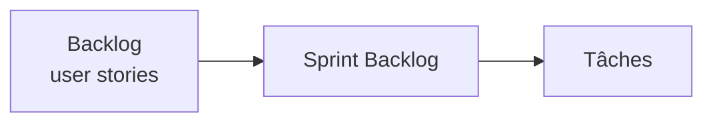
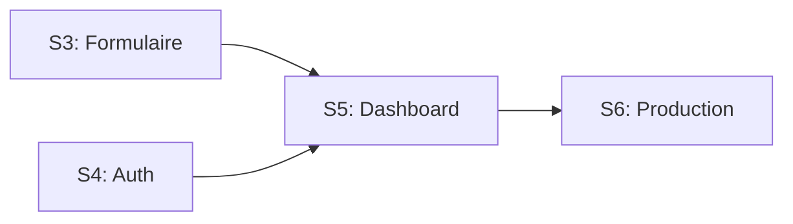
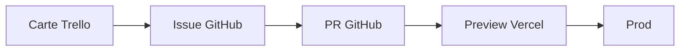
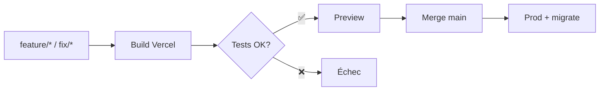
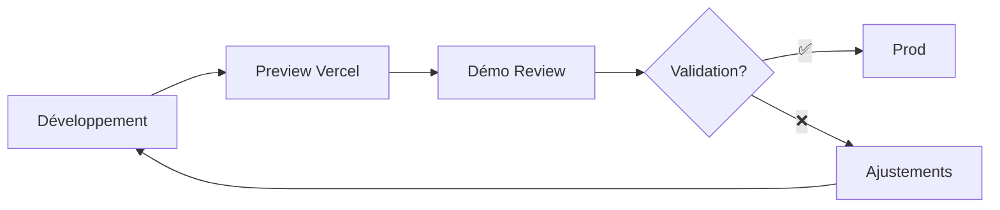

# Diététique et Interventions

## Présentation du projet & démo (Bloc 3)

### Coordonner et piloter un projet de développement d'applications logicielles

<div class="mt-6 card brand">
  <strong>Mars → Juin 2025 (3 mois) — Rôle : Développeur unique</strong>
  
</div>

<div class="mt-4 card lead">
  <p class="text-lg">
    <strong>Objectif :</strong> site vitrine + back-office de gestion des demandes de contact
  </p>
</div>

<div class="mt-4 card compact muted">
  <p><strong>Repo :</strong> https://github.com/Adrien490/dietetique-et-interventions</p>
  <p><strong>Prod :</strong> https://dietetique-et-interventions.manonchaillou.fr</p>
</div>

<!--
Situer l'audience (jury pro) et l'objectif : gestion de projet + démo.
-->

---

# Sommaire aligné au référentiel

<div class="columns-2">
  <div class="card centered"><strong>C3.1 Planifier</strong></div>
  <div class="card centered"><strong>C3.2.1 Piloter</strong></div>
  <div class="card centered"><strong>C3.2.2 Arbitrer</strong></div>
  <div class="card centered"><strong>C3.3.1 Manager l'équipe</strong></div>
  <div class="card centered"><strong>C3.3.2 Évaluer & développer</strong></div>
  <div class="card centered"><strong>C3.4.1 Suivi client & indicateurs</strong></div>
  <div class="card centered"><strong>C3.4.2 Démonstration</strong></div>
</div>

<!--
Préciser que chaque bloc du référentiel est couvert par au moins une slide dédiée.
-->

---

# Méthodologie choisie (C3.1) — Scrum (1/3)

## Approche Agile Scrum adaptée à un développeur unique

**Timeboxes sprints :** 2 semaines

### Rôles

- **Product Owner** = commanditaire
- **Scrum Master** = Adrien (facilitateur)
- **Dev Team** = Adrien

---

# Méthodologie choisie (C3.1) — Scrum — Événements (2/3)

### Événements

| Événement                | Format               | Durée     | Objectif                        |
| ------------------------ | -------------------- | --------- | ------------------------------- |
| **Sprint Planning**      | Début sprint         | 1h        | Objectif sprint, sprint backlog |
| **Daily**                | Asynchrone via board | 5 min     | Blocages, priorités du jour     |
| **Sprint Review**        | Hebdo présentiel     | -         | Démo increment Preview/Prod     |
| **Sprint Retrospective** | Fin de sprint        | 20-30 min | Amélioration processus          |

---

# Méthodologie choisie (C3.1) — Scrum — Suite (3/3)

### Artifacts

- **Product Backlog** : Issues GitHub
- **Sprint Backlog** : Board
- **Definition of Done** : lint + type-check + tests + Preview OK + CR client
- **Increment** : déploiement Vercel

### Bénéfices

✅ Prévisibilité (vélocité) • Time-to-value court • Transparence • Amélioration continue

<!--
Insister sur l'adaptation Scrum en solo (daily async, PO côté client, SM = facilitateur) et la valeur de la vélocité pour piloter.
-->

---

# Outil de planification (C3.1) (1/3)

## GitHub Projects (Board/Sprints) + Milestones

<div class="mt-4"></div>

### Format opérationnel



### Visualisation

- **Release Plan** par Sprint (Mars → Juin 2025)
- **Rétroplanning** haut niveau avec dépendances et chemin critique

---

# Outil de planification (C3.1) — Suite (2/3)

## Board Kanban

<div class="card table-sm">

| To do          | In progress | Code review | Done              |
| -------------- | ----------- | ----------- | ----------------- |
| Issues futures | WIP ≤ 2     | PR review   | Merged & deployed |

</div>

---

# Outil de planification (C3.1) — Suite (3/3)

### Milestones

- **S1** (04/03→15/03) : Cadrage
- **S2** (18/03→29/03) : Vitrine
- **S3** (01/04→12/04) : Contact
- **S4** (15/04→26/04) : Auth
- **S5** (29/04→10/05) : Dashboard
- **S6** (13/05→24/05) : Qualité & Prod

### Bénéfices

Vue sprint + réordonnancement simple, alignement avec Reviews/CR

<!--
Montrer la vue Board et Milestones; préciser comment le backlog alimente la planification.
-->

---

# Architecture & stack (C3.1) (1/2)

<div class="grid grid-cols-2 gap-8 text-sm equal-cols">

<div class="card">

### Front-end

- **Next.js 15** - Framework React
- **React 19** - Interface utilisateur
- **TypeScript strict** - Typage fort
- **Tailwind CSS** - Styling
- **Radix UI + shadcn/ui** - Composants

### Back-end

- **Server Actions** + API Routes
- **Prisma ORM** - Base de données

 </div>

</div>

---

# Architecture & stack (C3.1) — Suite (2/2)

<div class="grid grid-cols-3 gap-6 text-sm equal-cols">

<div class="card accent">

### Infrastructure

- **PostgreSQL** - Base de données
- **Better Auth** - Authentification
- **Vercel** - Hébergement & CI/CD

</div>

<div class="card">

### Qualité & Observabilité

- **Jest + RTL** - Tests
- **Lighthouse** - Performance
- **Pa11y** - Accessibilité
- **Sentry** - Monitoring

</div>

<div class="card">

### Bénéfices

- **Performance** : SSR/SSG optimisé
- **Sécurité** : TypeScript + validation Zod
- **Accessibilité** : WCAG 2.1 AA
- **Observabilité** : Erreurs & métriques temps réel

</div>

</div>

<!--
Lier les choix techniques aux risques/perf/accessibilité.
-->

---

# Architecture logique (C3.1)

## DDD léger : séparation par domaines

```
src/
├── app/              # Routes & layouts Next.js
├── domains/          # Logique métier
│   ├── auth/         # Authentification
│   ├── contact-request/  # Demandes de contact
│   └── user/         # Gestion utilisateurs
├── shared/           # Code partagé
│   ├── components/   # UI components
│   ├── actions/      # Server actions
│   ├── hooks/        # Hooks React
│   ├── utils/        # Utilitaires
│   └── schemas/      # Schémas Zod
└── prisma/           # Base de données
```


---

# Planning détaillé (C3.1) — Sprints S1→S6 (1/2)

<div class="text-sm card">

| Sprint | Dates       | Objectifs                                              |
| ------ | ----------- | ------------------------------------------------------ |
| **S1** | 04/03→15/03 | Cadrage fonctionnel, design, contenus vitrine          |
| **S2** | 18/03→29/03 | Vitrine + SEO                                          |
| **S3** | 01/04→12/04 | Formulaire contact (validation, upload ≤3×4MB, e-mail) |
| **S4** | 15/04→26/04 | Authentification + rôles                               |
| **S5** | 29/04→10/05 | Dashboard admin (listing, filtres, statuts, archivage) |
| **S6** | 13/05→24/05 | Qualité (tests, a11y, perf), RGPD, mise en production  |

</div>

---

# Planning détaillé (C3.1) — Pilotage & Dépendances (2/2)

## Phases & pilotage

- **Phases** : Étude → Conception → Réalisation → Recette → Déploiement
- **Chemin critique** : formulaire → dashboard, auth → dashboard
- **Points de vigilance** : quotas tiers, RGPD, performance

### Dépendances identifiées



<!--
Afficher les dates exactes adaptées à votre historique si différent; pointer les Reviews en fin de sprint.
-->

---

# Découpage en lots & user stories (C3.1)

## Lots fonctionnels

**Lot 1 Vitrine** : pages, SEO, contenus

**Lot 2 Contact** : schémas Zod, uploads (≤3, 4MB), e-mail Resend

**Lot 3 Auth** : Better Auth, rôles

**Lot 4 Dashboard** : liste, recherche, filtres, tri, détail, changement de statut, archivage

**Lot 5 Qualité & RGPD** : tests, a11y, perf, registre

---

# User Stories — Exemple détaillé (C3.1) (1/2)

## User Story (US-VIS-02)

**En tant que** visiteur,  
**Je veux** envoyer une demande de contact avec pièces jointes  
**Afin de** préparer mon suivi.

### Critères d'acceptation

- ✅ Validation Zod
- ✅ ≤3 fichiers
- ✅ Chaque fichier ≤4MB
- ✅ Types acceptés (jpg/png/pdf)

---

# User Stories — Exemple détaillé (C3.1) — Suite (2/2)

### Critères d'acceptation (suite)
- ✅ Message succès
- ✅ E-mail Resend reçu
- ✅ Entrée visible en dashboard statut = "Nouveau"

### Preuves

Issue #… → PR #… → Preview Vercel → Prod (SHA …)

<!--
Montrer 1 user story + critères d'acceptation + liens.
-->

---

# Ressources & responsabilités (C3.1)

<div class="grid grid-cols-2 gap-8">

<div>

### Équipe

**Développeur unique** : Adrien Poirier

### RACI (solo)

- **Adrien** = R/A (tous lots)
- **Consulted** = Commanditaire
- **Informed** = hébergeur/mentor si applicable

### Répartition des responsabilités

- Conception/UX (R/A)
- Front/Back/DB (R/A)
- Tests/Qualité (R/A)
- DevOps/CI/CD (R/A)
- Relation client (R/A)

</div>

<div>

### Ressources matérielles/Services

- **Vercel** - Hébergement & CI/CD
- **PostgreSQL** - Base de données
- **Sentry** - Monitoring
- **Resend** - E-mails
- **UploadThing** - Upload fichiers

### Budget par poste

_(Détail slide 13)_

### Handicap

- **Actuellement** : N/A
- **Protocole prévu** si onboarding d'un tiers

</div>

</div>

<!--
Expliquer comment un RACI reste pertinent même en équipe de 1 (C/I ≠ R/A).
-->

---

# Instances & outil de suivi (C3.2.1)

## Instances Scrum

<div class="grid grid-cols-2 gap-6 text-sm">

<div class="card">

### Événements réguliers

- **Daily** (async, board) : 5 min
- **Sprint Planning** (début) : 1h
- **Sprint Review** (hebdo présentiel) : démo Preview/Prod
- **Sprint Retrospective** (fin) : 20-30 min

### Outil de suivi : Trello

- **Colonnes** : To do / In progress / Code review / Done
- **WIP** = 2 sur "In progress"
- **Métriques** : burndown et vélocité via export/Power-Ups

</div>

<div class="card">

### Traçabilité



### Cohérence méthodologique

- Trello supporte Scrum (sprints, burndown, vélocité)
- Daily asynchrone via board
- Transparence totale avec le commanditaire

</div>

</div>

<!--
Montrer 1 carte « Done » liée à une PR et au déploiement Preview.
-->

---

# Pipeline CI/CD (C3.2.1)

## Workflow Git

<div class="mt-8">



</div>

---

# Pipeline CI/CD (C3.2.1) — Automatisation (1/2)

## Étapes automatisées

1. **Build Vercel**
   - Lint (ESLint)
   - Type-check (TypeScript)
   - Tests (Jest)
   - Build

2. **Preview** → recette + Sentry

---

# Pipeline CI/CD (C3.2.1) — Automatisation — Suite (2/2)

### Étapes automatisées (suite)

3. **Merge main** → Prod + `prisma migrate deploy`
 
4. **Rollback rapide** via Vercel

### Bénéfices

- Validation automatique
- Feedback rapide
- Déploiement sécurisé

<!--
Souligner le gain de temps en démo/validation.
-->

---

# Indicateurs de pilotage (C3.2.1)

<div class="grid grid-cols-2 gap-6 text-sm equal-cols">

<div class="card compact">

### Avancement & Qualité

- **Vélocité** : X pts/sprint (médiane S2–S6)
- **Burndown** : objectif vs restant
- **Tests** : 1557/1557 ✅
- **Coverage** : 56.64% → 70%

### Performance & Stabilité

- **Performance** : 92
- **Accessibilité** : 100
- **SEO** : 100
- **Best Practices** : 100
- **Erreurs Sentry** : < 1% (30j glissants)

</div>

<div class="card">

### Délais & Budget

- **Cycle time** : issue → prod (Y jours)
- **Coûts** : 0€ (paliers gratuits)
- **WIP** : 1–2 max
- **Risques** : matrice impact × probabilité

</div>

</div>

<!--
Ajouter captures datées (burndown/vélocité Trello, tableau budget, cycle time) + script lighthouse:prod.
-->

---

# Suivi coûts & ressources (C3.2.1) (1/2)

<div class="grid grid-cols-1 gap-6">

<div class="card">

### Coûts services (paliers gratuits)

| Service     | Palier  | Quota          | Conso M1/M2/M3    | Coût |
| ----------- | ------- | -------------- | ----------------- | ---- |
| Vercel      | Gratuit | 100GB/mois     | 45GB/72GB/38GB    | 0€   |
| Resend      | Gratuit | 3k emails/mois | 127/234/89        | 0€   |
| UploadThing | Gratuit | 2GB storage    | 0.8GB/1.2GB/0.6GB | 0€   |
| Sentry      | Gratuit | 5k errors/mois | 23/67/12          | 0€   |

**Total** : 0€ (paliers gratuits respectés)

</div>

</div>

---

# Suivi coûts & ressources (C3.2.1) — Suite (2/2)

### Capacité & risques

- **WIP** : 1–2 max • **Disponibilité** : 20h/semaine
- **Quotas dépassés** → optimisation/caching
- **Surveillance** : alertes à 80%

<!--
Insérer mini-tableau mensuel avec chiffres réels.
-->

---

# Risques, dérives, actions (C3.2.1)

<div class="grid grid-cols-1 gap-6">

<div class="card">

### Risques & actions

- **Risques** : sécurité, régressions, quotas, RGPD
- **Détection** : tests, Sentry, QA, retours client
- **Actions** : hotfix `fix/*`, feature toggle, patch deps

### Registre des risques

| Risque          | Impact | Probabilité | Propriétaire | Mitigation          |
| --------------- | ------ | ----------- | ------------ | ------------------- |
| Quota Vercel    | Moyen  | Faible      | Adrien       | Monitoring + plan B |
| Régression auth | Élevé  | Moyen       | Adrien       | Tests e2e           |

**Exemple résolu** : Issue #1 (footer/email mobile) → corrigée S2

</div>

</div>

<!--
Donner l'exemple de l'issue #1 (footer/email mobile) → corrigée.
-->

---

# Arbitrage (C3.2.2) — Cas réel documenté (1/3)

## Problème (S3, 11/04)

Les fichiers **.HEIC** (iPhone) ne sont pas traités par la chaîne d'upload (UploadThing) → échec silencieux, risque de non-réception des pièces jointes avant la Sprint Review S3.

## Conséquences

Impact potentiel sur la **qualité** (perte d'info), **délais** (Review S3), et **support** (tickets utilisateurs).

---

# Arbitrage (C3.2.2) — Cas réel documenté — Suite (2/3)

### Option 1 ✅ — Réduire le périmètre

- Types garantis (jpg/png/pdf)
- Message d'aide
- Validation client
- **→ Livraison maintenue**

### Option 2 — Décaler la livraison

- Repousser Review d'1 semaine
- Implémenter conversion serveur
- **→ Retard Sprint Review**

---

# Arbitrage (C3.2.2) — Décision & Critères (3/3)

## Option 3 — Renforcer l'équipe

- Recours externe ponctuel
- Lib conversion HEIC → JPEG
- **→ Coût/risque onboarding**

## Critères d'aide à la décision

Délai • Couverture besoin (≥95%) • Risque technique • Dette • Impact UX • Coût

## Décision (11/04) → Option 1 retenue

**Court terme** : Review S3 maintenue, formulaires fiables  
**Long terme** : Dette planifiée S6 ("conversion HEIC")

**Preuves** : Issue #34 → PR #56 → Preview (SHA 9f3c…) → CR client 11/04

---

# Affectation des missions (C3.3.1)

<div class="grid grid-cols-2 gap-8">

<div class="card">

### Équipe

**1 développeur** : Adrien Poirier

### Répartition des responsabilités

| Domaine             | Responsabilité |
| ------------------- | -------------- |
| **Conception/UX**   | R/A            |
| **Front/Back/DB**   | R/A            |
| **Tests/Qualité**   | R/A            |
| **DevOps/CI/CD**    | R/A            |
| **Relation client** | R/A            |

</div>

<div class="card">

### Auto-organisation

- **Priorisation** : Product Backlog ordonné
- **Planification** : Sprint Planning hebdo
- **Exécution** : WIP ≤ 2, focus
- **Adaptation** : Sprint Retrospective

### Protocole handicap

- **Actuellement** : N/A
- **Si extension équipe** :
  - Protocole d'accueil défini
  - Outils accessibles
  - Formation pair-programming

</div>

</div>

<!--
Expliquer l'auto-organisation et la priorisation.
-->

---

# Styles managériaux utilisés (C3.3.1) (1/2)

<div class="grid grid-cols-2 gap-8 text-sm equal-cols">

<div class="card compact">

### Styles par situation

<strong>🎯 Directif</strong>

- Incidents prod, sécurité
- Décision immédiate requise

<strong>💡 Persuasif</strong>

- Pédagogie client (bénéfices a11y/tests)
- Justification choix techniques

</div>

<div class="card compact">

<strong>🤝 Participatif</strong>

- Co-construction contenus vitrine en Review
- Validation UX/fonctionnalités

<strong>🎯 Délégatif</strong>

- N/A (équipe solo)
- Mention si sous-traitance future

</div>

</div>

---

# Styles managériaux utilisés (C3.3.1) — Suite (2/2)

<div class="grid grid-cols-2 gap-8 text-sm equal-cols">

<div class="card compact">

### Analyse critique : cas "prioriser RGPD vs Dashboard"

#### Ce qui a fonctionné ✅

- Explication des risques juridiques
- Visualisation impacts métier
- Co-décision avec commanditaire

#### À améliorer 🔄

- Anticipation des dépendances
- Planification plus fine des contraintes légales

</div>

<div class="card compact">

### Apprentissages

- **Communication visuelle** plus efficace
- **Implication client** dans les arbitrages
- **Documentation** des décisions

</div>

</div>

<!--
Mini anecdote (choix formulaire vs chat, impact RGPD).
-->

---

# Outils de communication (C3.3.1)

<div class="grid grid-cols-3 gap-6 text-sm equal-cols">

<div class="card compact">

### Présentiel/Visio

**Sprint Reviews hebdomadaires** (Google Meet)

- Ordre du jour structuré
- Démo Preview/Prod
- Décisions documentées
- Prochaines étapes claires

</div>

<div class="card compact">

### Asynchrone

- **E-mail** : CR formels, jalons
- **Trello** : commentaires, checklists
- **GitHub** : discussions techniques

</div>

<div class="card compact">

### Documentation

- **README/Repo** : architecture, scripts
- **Issues** : spécifications détaillées
- **PR** : contexte & review

### Objectifs

- **Traçabilité** : décisions & rationale
- **Clarté** : compréhension mutuelle
- **Engagement** : validation commanditaire


</div>

</div>

<!--
Positionner la documentation comme alternative à Confluence.
-->

---

# Grille d'évaluation des compétences (C3.3.2) (1/2)

<div class="card table-sm">

| Compétence                    | Niveau actuel | Cible | Preuves / Commentaires                                         |
| ----------------------------- | ------------- | ----- | -------------------------------------------------------------- |
| **Next.js / React**           | 3             | 4     | Vitrine + Dashboard en prod ; routing app dir ; Server Actions |
| **TypeScript strict**         | 3             | 4     | `tsc --noEmit` clean ; types Domain ; Zod schemas alignés      |
| **Prisma / SQL**              | 2             | 3     | Migrations `prisma migrate` ; indexations ; seed contrôlé      |
| **Tests (Jest/RTL)**          | 2             | 3     | 1557/1557 tests ; 56.64% coverage → 70% visé                   |

</div>

---

<div class="card table-sm">

| Compétence                    | Niveau actuel | Cible | Preuves / Commentaires                                   |
| ----------------------------- | ------------- | ----- | -------------------------------------------------------- |
| **A11y (WCAG)**               | 3             | 4     | Pa11y=0 ; Lighthouse A11y=100 ; focus & nav clavier      |
| **CI/CD Vercel**              | 3             | 4     | Preview par PR ; `VERCEL_GIT_COMMIT_SHA` exposé          |
| **RGPD & sécurité**           | 2             | 3     | Registre, DPA (Vercel/Sentry/Resend/UploadThing), headers |
| **Gestion de projet (Scrum)** | 3             | 4     | Sprints S1→S6 ; Reviews ; burndown ; vélocité             |

</div>


---

# Écarts & priorités de montée en compétences (C3.3.2)

<div class="grid grid-cols-1 gap-6">

<div>

### Écarts clés identifiés

- **Tests** : intégration/e2e manquants, coverage < 70%
- **Prisma** : requêtes avancées, transactions, performance
- **Pilotage** : KPIs fonctionnels (taux achèvement, délais)

### Priorités de développement

1. **Tests e2e** : Playwright (parcours Visiteur & Admin)
2. **Observabilité** : Sentry alerting, releases, traces
3. **RGPD** : registre complet, DPA, minimisation

</div>

</div>

<!--
Prioriser selon l'impact projet et les besoins métier.
-->

---

# Plan de développement (C3.3.2)

<div class="grid grid-cols-1 gap-6">

<div>

### Formations & pratique

- **Formations** : Playwright (1/2j), Prisma avancé, A11y WCAG 2.2, RGPD
- **Pratique** : pair-review externe, objectifs trimestriels, actions rétro

### Objectifs datés & mesurables

- **Coverage ≥ 70%** d'ici 30/06
- **2 parcours e2e** (Visiteur, Admin) stables en S6
- **Erreurs Sentry < 1%** sur 30 jours glissants

</div>

</div>

<!--
Lier développement des compétences aux objectifs projet.
-->

---

# Comptes rendus & décisions (C3.4.1)

<div class="grid grid-cols-1 gap-6">

<div>

### Format & fréquence

**CR e-mail structuré** : faits → décisions → risques → prochaines étapes

**Fréquence** : après chaque Review + jalons • **Stockage** : e-mails + README

### Exemple CR anonymisé

**Objet** : CR Review S3 - Formulaire contact validé

- **Faits** : Formulaire opérationnel, upload 3×4MB OK
- **Décisions** : Validation S4 (auth), priorisation rôles
- **Risques** : Quota UploadThing (1.2GB/2GB)
- **Next** : S4 auth Better Auth, rôles, protection routes

</div>

</div>

<!--
Exemple de 4-6 lignes anonymisé réel.
-->

---

# Points de validation (C3.4.1) (1/2)

### Jalons & Reviews (dates réelles)

<div class="grid grid-cols-2 gap-6">

<div>

**J1** (fin Mars) : Vitrine/SEO validés _(Review S2)_

**J2** (mi-Avril) : Formulaire + e-mail OK _(Review S3)_

**J3** (fin Avril) : Auth & rôles _(Review S4)_

</div>

<div>

**J4** (mi-Mai) : Dashboard (filtres, statuts, archives) _(Review S5)_

**J5** (fin Mai) : Qualité (Lighthouse/Pa11y) OK _(Review S6)_

**J6** (fin Mai) : Mise en production + démo finale

</div>

</div>

---

# Points de validation (C3.4.1) — Suite (2/2)

### Processus validation



### Critères GO/NO-GO

 - Tests passants
 - Lighthouse ≥ seuils
 - Validation commanditaire

<!--
Chaque jalon = démo live sur Vercel Preview puis prod.
-->

---

# Indicateurs de satisfaction (C3.4.1)

<div class="grid grid-cols-1 gap-6">

<div>

### Satisfaction & usage

- **NPS** post-démo • **Questionnaire 1–5** après Review
- **Taux d'achèvement** formulaire • **Délai** création → traité
- **Taux rebond** pages vitrine

### Qualité technique

- **Erreurs Sentry** : < 1%
- **Lighthouse** : Perf ≥ 90, A11y 100, SEO 100, BP 100

</div>

</div>

<!--
Expliquer comment chaque KPI influence les priorités.
-->

---

# Améliorations & évolutions (C3.4.1)

<div class="grid grid-cols-1 gap-6">

<div>

### Boucle d'amélioration

**Retour client** → **Issue GitHub** → **Sprint Backlog** → **PR** → **Preview** → **Prod**

### Exemples & roadmap

- **Corrigé** : Issue #1 (footer/email mobile) en S2
- **Planifié** : Issue #34 (HEIC) en S6/S7

### Roadmap produit

- **S6** : Tests e2e, RGPD, performance
- **Q3 2025** : Module Devis, conversion HEIC
- **Q4 2025** : Notifications, export, API

</div>

</div>

<!--
Montrer avant/après si possible pour les améliorations.
-->

---

<div class="text-center h-full flex flex-col justify-center">

# Démo (C3.4.2) — Scénario Visiteur (1/3)

## Scénario Visiteur

<div class="mt-6 text-sm muted">
  <p>URL: https://dietetique-et-interventions.manonchaillou.fr</p>
</div>

### Parcours

Accueil → Prestations → Contact → Upload → Envoi → Confirmation

<div class="mt-4 text-sm text-gray-600">
  <p>🎯 Validation • Upload ≤3×4MB • E-mail envoyé</p>
</div>

</div>

<!--
Verrouiller réseau/onglets avant la démo; garder un jeu de fichiers test.
-->

---

<div class="text-center h-full flex flex-col justify-center">

# Démo (C3.4.2) — Scénario Admin (2/3)

## Scénario Admin

<div class="mt-6 text-sm muted">
  <p>Compte test: jury@ynov.com • mdp: d85pm832</p>
</div>

### Parcours

Dashboard → Contact-requests → Détail → Statut → Archivage

<div class="mt-4 text-sm text-gray-600">
  <p>📊 Tri rapide • Traçabilité • Workflow optimisé</p>
</div>

</div>

<!--
Verbaliser bénéfices métier : tri plus rapide, traçabilité, archivage.
-->

---

# Démo (C3.4.2) — Critères de validation (3/3)

<div class="grid grid-cols-2 gap-8">

<div>

### Critères fonctionnels

✅ **Couverture fonctionnalités** attendues  
✅ **Robustesse** (validation, gestion erreurs)  
✅ **Traçabilité** (statuts, archives)

### Critères techniques

✅ **Accessibilité** (navigation clavier, focus)  
✅ **Performance** (réactivité UI)  
✅ **Sécurité** (authentification, validation)

</div>

<div>

### Critères qualité

- **UX** : parcours fluides
- **Responsive** : mobile/desktop
- **SEO** : référencement optimal
- **Maintenance** : code lisible, testé

### Validation finale

**"Version utilisable"** pour validation commanditaire

</div>

</div>


---

# Sécurité & RGPD (Annexe)

<div class="grid grid-cols-1 gap-6">

<div>

### Sécurité & authentification

- **OWASP** : RBAC, validation Zod, headers CSP/HSTS
- **Better Auth** : sessions sécurisées, rôles Admin/Nutritionniste
- **Monitoring** : Sentry logs

### RGPD

- **Registre** : traitements documentés
- **DPA** : Vercel, Sentry, Resend, UploadThing
- **Flux** : Collecte → Stockage → Usage → Conservation → Suppression
- **Droits** : accès, rectification, effacement, portabilité

</div>

</div>

<!--
Positionner ce qui est déjà fait vs à faire.
-->

---

# Qualité & tests (Annexe)

<div class="grid grid-cols-1 gap-6">

<div>

### Tests & métriques qualité

- **Jest/RTL** : 1557/1557 passants ✅
- **Coverage** : 56.64% → objectif 70%
- **Lighthouse prod** : Perf 92, A11y 100, SEO 100, BP 100
- **Pa11y** : 0 issue ✅

### Scripts & surveillance

- `npm run test:coverage` • `npm run lighthouse:prod` • `npm run a11y:prod`
- **Surveillance** : Sentry (erreurs), Vercel Analytics (perf)

</div>

</div>

<!--
Rappeler scripts npm (test, coverage, lighthouse:prod, a11y:prod).
-->

---

# CI/CD & traçabilité (Annexe)

<div class="grid grid-cols-1 gap-6">

<div class="card">

### Pipeline & traçabilité

- **Pipeline** : Feature branch → Build/tests → Preview → Prod
- **Migrations** : `prisma migrate deploy`
- **Variables** : `VERCEL_GIT_COMMIT_SHA`, `VERCEL_ENV`
- **Rollback** : redeploy build précédent

### Traçabilité complète

**Issue #42** → **PR #87** → **SHA a1b2c3** → **Preview** → **Review** → **Prod**

</div>

</div>
